# Sets, Relations and Functions

> a set is many that allows itself to be thought of as a one
>
> — Cantor

## 1.1 Introduction

The concepts of sets, relations and functions occupy a fundamental place in the mainstream of mathematical thinking. As rightly stated by the Russian mathematician Luzin the concept of functions did not arise suddenly. It underwent profound changes in time. Galileo (1564-1642) explicitly used the dependency of one quantity on another in the study of planetary motions. Descartes (1596-1650) clearly stated that an equation in two variables, geometrically represented by a curve, indicates dependence between variable quantities. Leibnitz (1646-1716) used the word "function", in a 1673 manuscript, to mean any quantity varying from point to point of a curve. Dirichlet (1805-1859), a student of Gauss, was credited with the modern "formal" definition of function with notation \( y = f(x) \). In the \( 20^{\mathrm{th}} \) century, this concept was extended to include all arbitrary correspondence satisfying the uniqueness condition between sets and numerical or non-numerical values.

With the development of set theory, initiated by Cantor (1845-1918), the notion of function continued to evolve. From the notion of correspondence, mathematicians moved to the notion of relation. However even now in the theory of computation, a function is not viewed as a relation but as a computational rule. The modern definition of a function is given in terms of relation so as to suit to develop artificial intelligence.

In the previous classes, we have studied and are well versed with the real numbers and arithmetic operations on them. We also learnt about sets of real numbers, Venn diagrams, Cartesian product of sets, basic definitions of relations and functions. For better understanding, we recall more about sets and Cartesian products of sets. In this chapter, we see a new facelift to the mathematical notions of "Relations" and "Functions".
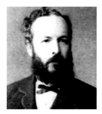
**Cantor 1845-1918**

## Learning Objectives

On completion of this chapter, the students are expected to

- list and work with many properties of sets and Cartesian product
- know the concepts of constants, variables, intervals and neighbourhoods
- understand about various types of relations
- create relations of any required type
- represent functions in different ways
- work with elementary functions, types of functions, operations on functions including inverse of a bijective function
- identify the graphs of some special functions
- visualize and sketch the graphs of some relatively complicated functions

## 1.2 Sets

In the earlier classes, we have seen that a set is a collection of well-defined objects. As the theory of sets is the building blocks of modern mathematics, one has to learn the concepts of sets carefully and deeply. Now we look at the term "well-defined" a little more deeply. Consider the two statements:

(i) The collection of all beautiful flowers in Ooty Rose Garden.
(ii) The collection of all old men in Tamilnadu.

The terms "beautiful flowers" and "old men" are not well-defined. We cannot define the term "beautiful flower" in a sharp way as there is no concrete definition for beauty because the concept of beauty varies from person to person, content to content and object to object. We should not consider statements like "the collection of all beautiful flowers in Ooty Rose Garden" as a set. Now, can we say "the collection of all red flowers in Ooty Rose Garden" a set? The answer is "yes".

One may consider a person of age 60 as old and others may not agree. There is no specific and concrete definition for "old men". The second statement can be made more sharply as

"the collection of all men in Tamilnadu of age greater than \( 70 \)"

Now, the above collection becomes a set because of definiteness in the age. Thus, the description of a set should enable us to concretely decide whether a given particular object (element) is available in the collection or not. So set is a distinguishable collection of objects.

We have also seen and learnt to use symbols like \( \in \), \( \subset \), \( \subseteq \), \( \cup \) and \( \cap \). Let us start with the question:

"If \( A \) and \( B \) are two sets, is it meaningful to write \( A \in B \)?"

At the first sight one may hurry to say that this is always meaningless by telling, "the symbol \( \in \) should be used between an element and a set and it should not be used between two sets". The first part of the statement is true whereas the second part is not true. For example, if \( A = \{1,2\} \) and \( B = \{1,\{1,2\},3,4\} \), then \( A \in B \). In this section we shall discuss the meaning of such symbols more deeply.

As we learnt in the earlier classes the set containing no elements is called an empty set or a void set. It is usually denoted by \( \emptyset \) or \( \{\} \). By \( A \subseteq B \), we mean every element of the set \( A \) is an element of the set \( B \). In this case, we say \( A \) is a subset of \( B \) and \( B \) is a super set of \( A \). For any two sets \( A \) and \( B \), if \( A \subseteq B \) and \( B \subseteq A \), then the two sets are equal. For any set \( A \), the empty set \( \emptyset \) and the set \( A \) are always subsets of \( A \). These two subsets are called trivial subsets. Further, we say \( A \) is a proper subset of \( B \) if \( A \) is a subset of \( B \) and \( A \neq B \). That is, \( B \) contains all elements of \( A \) and at least one element which is not in \( A \). Note that, as every element of \( A \) is an element of \( A \), we have \( A \subseteq A \). Thus, any set is a subset of itself. This subset is called an improper subset. In other words, for any set \( A \), \( A \) is the improper subset of \( A \). It is known that, \( \mathbb{N} \subset \mathbb{W} \subset \mathbb{Z} \subset \mathbb{Q} \subset \mathbb{R} \), where \( \mathbb{N} \) denotes the set of all natural numbers or positive integers, \( \mathbb{W} \) denotes the set of all non-negative integers, \( \mathbb{Z} \) denotes the set of all integers, \( \mathbb{Q} \) denotes the set of all rational numbers and \( \mathbb{R} \) denotes the set of all real numbers. Note that, the set of all irrational numbers is a subset of \( \mathbb{R} \) but not a subset of any other set mentioned above.

We learnt that the union of two sets \( A \) and \( B \) is denoted by \( A \cup B \) and is defined as

$$
A \cup B = \{x : x \in A \text{ or } x \in B\}
$$

and the intersection as

$$
A \cap B = \{x : x \in A \text{ and } x \in B\}.
$$

Two sets \( A \) and \( B \) are disjoint if they do not have any common element. That is, \( A \) and \( B \) are disjoint if \( A \cap B = \emptyset \).

Let us see some more notations. We are familiar with notations like \( \sum_{i = 1}^{n} a_i \). This in fact stands for \( a_1 + a_2 + \dots + a_n \). Similarly we can use the notations \( \bigcup_{i = 1}^{n} A_i \) and \( \bigcap_{i = 1}^{n} A_i \) to denote \( A_1 \cup A_2 \cup \dots \cup A_n \) and \( A_1 \cap A_2 \cap \dots \cap A_n \) respectively.

Thus,

$$
\bigcup_{i = 1}^{n} A_i = \{x : x \in A_i \text{ for some } i\}
$$

and

$$
\bigcap_{i = 1}^{n} A_i = \{x : x \in A_i \text{ for each } i\}.
$$

These notations are useful when we discuss more number of sets.

If \( A \) is a set, then the set of all subsets of \( A \) is called the power set of \( A \) and is usually denoted as \( \mathcal{P}(A) \). That is, \( \mathcal{P}(A) = \{B : B \subseteq A\} \). The number of elements in \( \mathcal{P}(A) \) is \( 2^n \), where \( n \) is the number of elements in \( A \).

Now, to define the complement of a set, it is necessary to know about the concept of universal set. Usually all sets under consideration in a mathematical process are assumed to be subsets of some fixed set. This basic set is called the universal set. For example, depending on the situation, for the set of prime numbers, the universal set can be any one of the sets containing the set of prime numbers. Thus, one of the sets \( \mathbb{N}, \mathbb{W}, \mathbb{Z}, \mathbb{Q}, \mathbb{R} \) may be taken as a universal set for the set of prime numbers, depending on the requirement. Universal set is usually denoted by \( U \).

To define the complement of a set, we have to fix the universal set. Let \( A \) be a subset of the universal set \( U \). The complement of \( A \) with respect to \( U \) is denoted as \( A' \) or \( A^c \) and defined as

$$
A' = \{x : x \in U \text{ and } x \notin A\}.
$$

The set difference of the set \( A \) to the set \( B \) is denoted by either \( A - B \) or \( A \setminus B \) and is defined as

$$
A - B = \{a : a \in A \text{ and } a \notin B\}.
$$

Note that,

\[
\begin{aligned}
&\text{(i) } U - A = A' \\
&\text{(ii) } A - A = \emptyset \\
&\text{(iii) } \emptyset - A = \emptyset \\
&\text{(iv) } A - \emptyset = A \\
&\text{(v) } A - U = \emptyset.
\end{aligned}
\]

The symmetric difference between two sets \( A \) and \( B \) is denoted by \( A \Delta B \) and is defined as

$$
A \Delta B = (A - B) \cup (B - A).
$$

Actually the elements of \( A \Delta B \) are the elements of \( A \cup B \) which are not in \( A \cap B \). Thus

$$
A \Delta B = (A \cup B) - (A \cap B).
$$

A set \( X \) is said to be a finite set if it has \( k \) elements for some \( k \in \mathbb{W} \). In this case, we say the finite set \( X \) is of cardinality \( k \) and is denoted by \( n(X) \). A set is an infinite set if it is not finite. For an infinite set \( A \), the cardinality is infinity. If \( n(A) = 1 \), then it is called a singleton set. Note that \( n(\emptyset) = 0 \) and \( n(\{\emptyset\}) = 1 \).

### 1.2.1 Properties of Set Operations

We now list out some of the properties.

**Commutative**

(i) \( A \cup B = B \cup A \)
(ii) \( A \cap B = B \cap A \)

**Associative**

\[
\text{(i) } (A \cup B) \cup C = A \cup (B \cup C) \qquad \text{(ii) } (A \cap B) \cap C = A \cap (B \cap C).
\]

**Distributive**

\[
\text{(i) } A \cup (B \cap C) = (A \cup B) \cap (A \cup C) \qquad \text{(ii) } A \cap (B \cup C) = (A \cap B) \cup (A \cap C).
\]

**Identity**

\[
\text{(i) } A \cup \emptyset = A \qquad \text{(ii) } A \cap U = A.
\]

**Idempotent**

\[
\text{(i) } A \cup A = A \qquad \text{(ii) } A \cap A = A.
\]

**Absorption**

\[
\text{(i) } A \cup (A \cap B) = A \qquad \text{(ii) } A \cap (A \cup B) = A.
\]

**De Morgan Laws**

\[
\text{(i) } (A \cup B)' = A' \cap B' \qquad \text{(ii) } (A \cap B)' = A' \cup B'
\]

\[
\text{(iii) } A - (B \cup C) = (A - B) \cap (A - C) \qquad \text{(iv) } A - (B \cap C) = (A - B) \cup (A - C).
\]

**On Symmetric Difference**

\[
\text{(i) } A \Delta B = B \Delta A \qquad \text{(ii) } (A \Delta B) \Delta C = A \Delta (B \Delta C)
\]

\[
\text{(iii) } A \cap (B \Delta C) = (A \cap B) \Delta (A \cap C).
\]

**On Empty Set and Universal Set**

\[
\text{(i) } U = U \qquad \text{(ii) } U' = \emptyset
\]

\[
\text{(iii) } A \cup A' = U \qquad \text{(iv) } A \cap A' = \emptyset
\]

\[
\text{(v) } A \cup U = U \qquad \text{(vi) } A \cap U = A.
\]

**On Cardinality**

(i) For any two finite sets \( A \) and \( B \)

$$
n(A \cup B) = n(A) + n(B) - n(A \cap B)
$$

(ii) If \( A \) and \( B \) are disjoint finite sets, then

$$
n(A \cup B) = n(A) + n(B)
$$

(iii) For any three finite sets \( A, B \) and \( C \)

$$
n(A \cup B \cup C) = n(A) + n(B) + n(C) - n(A \cap B) - n(A \cap C) - n(B \cap C) + n(A \cap B \cap C).
$$

## 1.3 Cartesian Product

We know that the Cartesian product of sets is nothing but a set of ordered elements. In particular, Cartesian product of two sets is a set of ordered pairs, while the Cartesian product of three sets is a set of ordered triplets. Precisely, let \( A, B \) and \( C \) be three sets. Then the Cartesian product of \( A \) with \( B \) is denoted by \( A \times B \). It is defined by

$$
A \times B = \{(a,b) : a \in A, b \in B\}.
$$

Similarly, the Cartesian product \( A \times B \times C \) is defined by

$$
A \times B \times C = \{(a,b,c) : a \in A, b \in B, c \in C\}.
$$

Thus

$$
A \times A = \{(a,b) : a,b \in A\}
$$

It is important that the elements of the Cartesian product are ordered and hence, for non-empty sets,

$$
A \times B \neq B \times A, \text{ unless } A = B.
$$

That is, for non-empty sets \( A \times B = B \times A \) if and only if \( A = B \). We know that \( \mathbb{R} \) denotes the set of real numbers and

$$
\mathbb{R} \times \mathbb{R} = \{(x,y) : x,y \in \mathbb{R}\}.
$$

$$
\mathbb{R} \times \mathbb{R} \times \mathbb{R} = \{(x,y,z) : x,y,z \in \mathbb{R}\}.
$$

Symbolically, \( \mathbb{R} \times \mathbb{R} \) can be represented as \( \mathbb{R}^2 \) and \( \mathbb{R} \times \mathbb{R} \times \mathbb{R} \) as \( \mathbb{R}^3 \). Note that \( \mathbb{R} \times \mathbb{R} \) is a set of ordered pairs and \( \mathbb{R} \times \mathbb{R} \times \mathbb{R} \) is a set of ordered triplets.

If \( A = \{1,2,3\} \) and \( B = \{2,4,6\} \) then

$$
A \times B = \{(1,2),(1,4),(1,6),(2,2),(2,4),(2,6),(3,2),(3,4),(3,6)\}.
$$

Here \( A \times B \) is a subset of \( \mathbb{R} \times \mathbb{R} \). The number of elements in \( A \times B \) is the product of the number of elements in \( A \) and the number of elements in \( B \), that is, \( n(A \times B) = n(A)n(B) \), if \( A \) and \( B \) are finite. Further \( n(A \times B \times C) = n(A)n(B)n(C) \), if \( A, B \) and \( C \) are finite.

It is easy to see that the following are the subsets of \( \mathbb{R} \times \mathbb{R} \)

### Example 1.1

Find the number of subsets of \( A \) if \( A = \{x : x = 4n + 1, 2 \leq n \leq 5, n \in \mathbb{N}\} \)

**Solution:**

Clearly \( A = \{x : x = 4n + 1, n = 2,3,4,5\} = \{9,13,17,21\} \). Hence \( n(A) = 4 \). This implies that

$$
n(\mathcal{P}(A)) = 2^4 = 16
$$

### Example 1.2

In a survey of 5000 persons in a town, it was found that \( 45\% \) of the persons know Language \( A \), \( 25\% \) know Language \( B \), \( 10\% \) know Language \( C \), \( 5\% \) know Languages \( A \) and \( B \), \( 4\% \) know Languages \( B \) and \( C \), and \( 4\% \) know Languages \( A \) and \( C \). If \( 3\% \) of the persons know all the three Languages, find the number of persons who knows only Language \( A \).

**Solution:**

This problem can be solved either by property of cardinality or by Venn diagram.

**Cardinality:** Given that

\[
\begin{aligned}
n(A) &= 45\% \text{ of } 5000 = 2250 \\
n(B) &= 1250 \\
n(C) &= 500 \\
n(A \cap B) &= 250 \\
n(B \cap C) &= 200 \\
n(C \cap A) &= 200 \\
n(A \cap B \cap C) &= 150
\end{aligned}
\]

The number of persons who knows only Language \( A \) is

\[
\begin{aligned}
n(A \cap B' \cap C') &= n\{A \cap (B \cup C)'\} \\
&= n(A) - n\{A \cap (B \cup C)\} \\
&= n(A) - n(A \cap B) - n(A \cap C) + n(A \cap B \cap C) \\
&= 2250 - 250 - 200 + 150 = 1950.
\end{aligned}
\]

Thus the required number of persons is 1950.

**Venn diagram:** We draw the Venn Diagram using percentage.
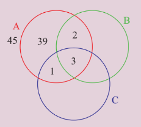

**Figure 1.1**

From Figure 1.1, the percentage of persons who knows only Language \( A \) is \( 39 \). Therefore, the required number of persons is

$$
5000 \times \frac{39}{100} = 1950
$$

### Example 1.3

Prove that

$$
((A \cup B' \cup C) \cap (A \cap B' \cap C')) \cup ((A \cup B \cup C') \cap (B' \cap C')) = B' \cap C'.
$$

**Solution:**

We have \( A \cap B' \cap C' \subseteq A \subseteq A \cup B' \cup C \) and hence

$$
(A \cup B' \cup C) \cap (A \cap B' \cap C') = A \cap B' \cap C'
$$

Also, \( B' \cap C' \subseteq C' \subseteq A \cup B \cup C' \) and hence

$$
(A \cup B \cup C') \cap (B' \cap C') = B' \cap C'
$$

Now as \( A \cap B' \cap C' \subseteq B' \cap C' \), we have

$$
((A \cup B' \cup C) \cap (A \cap B' \cap C')) \cup ((A \cup B \cup C') \cap (B' \cap C')) = B' \cap C'.
$$

Try to simplify the above expression using Venn diagram.

### Example 1.4

If \( X = \{1,2,3,\ldots,10\} \) and \( A = \{1,2,3,4,5\} \), find the number of sets \( B \subseteq X \) such that \( A - B = \{4\} \).

**Solution:**

For every subset \( C \) of \( \{6,7,8,9,10\} \), let \( B = C \cup \{1,2,3,5\} \). Then \( A - B = \{4\} \). In other words, for every subset \( C \) of \( \{6,7,8,9,10\} \), we have a unique set \( B \) so that \( A - B = \{4\} \). So number of sets \( B \subseteq X \) such that \( A - B = \{4\} \) and the number of subsets of \( \{6,7,8,9,10\} \) are the same. So the number of sets \( B \subseteq X \) such that \( A - B = \{4\} \) is \( 2^5 = 32 \).

### Example 1.5

If \( A \) and \( B \) are two sets so that \( n(B - A) = 2n(A - B) = 4n(A \cap B) \) and if \( n(A \cup B) = 14 \), then find \( n(\mathcal{P}(A)) \).

**Solution:**

To find \( n(\mathcal{P}(A)) \), we need \( n(A) \).

Let \( n(A \cap B) = k \). Then \( n(A - B) = 2k \) and \( n(B - A) = 4k \).

Now

$$
n(A \cup B) = n(A - B) + n(B - A) + n(A \cap B) = 7k.
$$

It is given that \( n(A \cup B) = 14 \). Thus \( 7k = 14 \) and hence \( k = 2 \).

So \( n(A - B) = 4 \) and \( n(B - A) = 8 \). As \( n(A) = n(A - B) + n(A \cap B) \), we get \( n(A) = 6 \) and hence \( n(\mathcal{P}(A)) = 2^6 = 64 \).

### Example 1.6

Two sets have \( m \) and \( k \) elements. If the total number of subsets of the first set is 112 more than that of the second set, find the values of \( m \) and \( k \).

**Solution:**

Let \( A \) and \( B \) be the two sets with \( n(A) = m \) and \( n(B) = k \). Since \( A \) contains more elements than \( B \), we have \( m > k \). From the given conditions we see that

$$
2^m - 2^k = 112.
$$

Thus we get,

$$
2^k(2^{m - k} - 1) = 2^4 \times 7.
$$

Then the only possibility is \( k = 4 \) and \( 2^{m - k} - 1 = 7 \). So \( m - k = 3 \) and hence \( m = 7 \).

### Example 1.7

If \( n(A) = 10 \) and \( n(A \cap B) = 3 \) find \( n((A \cap B)' \cap A) \).

**Solution:**

\[
\begin{aligned}
(A \cap B)' \cap A &= (A' \cup B') \cap A \\
&= (A' \cap A) \cup (B' \cap A) \\
&= \emptyset \cup (B' \cap A) \\
&= (B' \cap A) = A - B.
\end{aligned}
\]

So

$$
n((A \cap B)' \cap A) = n(A - B) = n(A) - n(A \cap B) = 7.
$$

### Example 1.8

If \( A = \{1,2,3,4\} \) and \( B = \{3,4,5,6\} \), find \( n((A \cup B) \times (A \cap B) \times (A \Delta B)) \).

**Solution:**

We have

\[
n(A \cup B) = 6,\quad n(A \cap B) = 2,\quad n(A \Delta B) = 4
\]

So,

$$
n((A \cup B) \times (A \cap B) \times (A \Delta B)) = n(A \cup B) \times n(A \cap B) \times n(A \Delta B) = 6 \times 2 \times 4 = 48.
$$

### Example 1.9

If \( \mathcal{P}(A) \) denotes the power set of \( A \), then find \( n(\mathcal{P}(\mathcal{P}(\mathcal{P}(\mathcal{P}(\emptyset))))) \).

**Solution:**

Since \( \mathcal{P}(\emptyset) \) contains 1 element, \( \mathcal{P}(\mathcal{P}(\emptyset)) \) contains \( 2^1 \) elements and hence \( \mathcal{P}(\mathcal{P}(\mathcal{P}(\emptyset))) \) contains \( 2^2 \) elements. That is, 4 elements.

Thus

$$
n(\mathcal{P}(\mathcal{P}(\mathcal{P}(\mathcal{P}(\emptyset))))) = 2^4 = 16.
$$

## Exercise 1.1

1. Write the following in roster form.

   (i) \( \{x \in \mathbb{N} : x^2 < 121 \text{ and } x \text{ is a prime}\} \)

   (ii) the set of all positive roots of the equation \( (x - 1)(x + 1)(x^2 - 1) = 0 \)

   (iii) \( \{x \in \mathbb{N} : 4x + 9 < 52\} \)

   (iv) \( \{x : \frac{x - 4}{x + 2} = 3, x \in \mathbb{R} - \{-2\}\} \)

2. Write the set \( \{-1, 1\} \) in set builder form.

3. State whether the following sets are finite or infinite.

   (i) \( \{x \in \mathbb{N} : x \text{ is an even prime number}\} \)

   (ii) \( \{x \in \mathbb{N} : x \text{ is an odd prime number}\} \)

   (iii) \( \{x \in \mathbb{Z} : x \text{ is even and less than } 10\} \)

   (iv) \( \{x \in \mathbb{R} : x \text{ is a rational number}\} \)

   (v) \( \{x \in \mathbb{N} : x \text{ is a rational number}\} \)

4. By taking suitable sets \( A, B, C \), verify the following results:

   (i) \( A \times (B \cap C) = (A \times B) \cap (A \times C) \)

   (ii) \( A \times (B \cup C) = (A \times B) \cup (A \times C) \)

   (iii) \( (A \times B) \cap (B \times A) = (A \cap B) \times (B \cap A) \)

   (iv) \( C - (B - A) = (C \cap A) \cup (C \cap B') \)

   (v) \( (B - A) \cap C = (B \cap C) - A = B \cap (C - A) \)

   (vi) \( (B - A) \cup C = (B \cup C) - (A - C) \)

5. Justify the trueness of the statement:

   "An element of a set can never be a subset of itself."

6. If \( n(\mathcal{P}(A)) = 1024 \), \( n(A \cup B) = 15 \) and \( n(\mathcal{P}(B)) = 32 \), then find \( n(A \cap B) \).

7. If \( n(A \cap B) = 3 \) and \( n(A \cup B) = 10 \), then find \( n(\mathcal{P}(A \Delta B)) \).

8. For a set \( A \), \( A \times A \) contains 16 elements and two of its elements are \( (1,3) \) and \( (0,2) \). Find the elements of \( A \).

9. Let \( A \) and \( B \) be two sets such that \( n(A) = 3 \) and \( n(B) = 2 \). If \( (x,1), (y,2), (z,1) \) are in \( A \times B \) find \( A \) and \( B \), where \( x, y, z \) are distinct elements.

10. If \( A \times A \) has 16 elements, \( S = \{(a,b) \in A \times A : a < b\} \); \( (-1,2) \) and \( (0,1) \) are two elements of \( S \), then find the remaining elements of \( S \).

## 1.4 Constants and Variables, Intervals and Neighbourhoods

To continue our discussion, we need certain prerequisites namely, constants, variables, independent variables, dependent variables, intervals and neighbourhoods.

### 1.4.1 Constants and Variables

A quantity that remains unaltered throughout a mathematical process is called a **constant**. A quantity that varies in a mathematical process is called a **variable**. A variable is an **independent variable** when it takes any arbitrary (independent) value not depending on any other variables, whereas if its value depends on other variables, then it is called a **dependent variable**.

We know the area \( A \) of a triangle is given by \( A = \frac{1}{2} bh \). Here \( \frac{1}{2} \) is a constant and \( A, b, h \) are variables. Moreover \( b \) and \( h \) are independent variables and \( A \) is a dependent variable. We ought to note that the terms dependent and independent are relative terms. For example in the equation \( x + y = 1 \), \( x, y \) are variables and 1 is a constant. Which of \( x \) and \( y \) is dependent and which one is independent? If we consider \( x \) as an independent variable, then \( y \) becomes dependent whereas if we consider \( y \) as an independent variable, then \( x \) becomes dependent.

Further consider the following examples:

(i) area of a rectangle \( A = \ell b \)

(ii) area of a circle \( A = \pi r^2 \)

(iii) volume of a cuboid \( V = \ell b h \)

From the above examples we can directly infer that \( b, h, \ell, r \) are independent variables; \( A \) and \( V \) are dependent variables and \( \pi \) is a constant.

### 1.4.2 Intervals and Neighbourhoods

The system \( \mathbb{R} \) of real numbers can be represented by the points on a line and a point on the line can be related to a unique real number as in Figure 1.2. By this, we mean that any real number can be identified as a point on the line. With this identification we call the line as the real line.
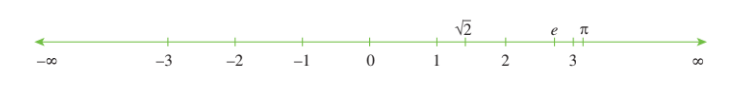
**Figure 1.2**

The value increases as we go right and decreases as we go left. If \( x \) lies to the left of \( y \) on the real line then \( x < y \). As there is no gap in a line, we have infinitely many real numbers between any two real numbers.

### Definition 1.1

A subset \( I \) of \( \mathbb{R} \) is said to be an **interval** if

(i) \( I \) contains at least two elements and

(ii) \( a, b \in I \) and \( a < c < b \) then \( c \in I \)

Geometrically, intervals correspond to rays and line segments on the real line.

Note that the set of all natural numbers, the set of all non-negative integers, set of all odd integers, set of all even integers, set of all prime numbers are not intervals. Further observe that, between any two real numbers there are infinitely many real numbers and hence the above sets are not intervals.

Consider the following sets:

(i) The set of all real numbers greater than 0.

(ii) The set of all real numbers greater than 5 and less than 7.

(iii) The set of all real numbers \( x \) such that \( 1 \leq x \leq 3 \).

(iv) The set of all real numbers \( x \) such that \( 1 < x \leq 2 \).

The above four sets are intervals. In particular (i) is an infinite interval and (ii), (iii) and (iv) are finite intervals. The term "finite interval" does not mean that the interval contains only finitely many real numbers, however both ends are finite numbers. Both finite and infinite intervals are infinite sets. The intervals correspond to line segments are finite intervals whereas the intervals that correspond to rays and the entire real line are infinite intervals.

A finite interval is said to be **closed** if it contains both of its end points and **open** if it contains neither of its end points. Symbolically the above four intervals can be written as \( (0, \infty) \), \( (5, 7) \), \( [1, 3] \), \( (1, 2] \). Note that for symbolic form we used parentheses and square brackets to denote intervals. ( ) parentheses indicate open interval and [ ] square brackets indicate closed interval. The first two sets are open intervals, third one is a closed interval. Note that fourth set is neither open nor closed, that is, one end open and other end closed.

In particular \( [1, 3] \) contains both 1 and 3 and in between real numbers. The interval \( (1, 3) \) does not contain 1 and 3 but contains all in between the numbers. The interval \( (1, 2] \) does not contain 1 but contains 2 and all in between numbers.

Note that \( \infty \) is not a number. The symbols \( -\infty \) and \( \infty \) are used to indicate the ends of real line. Further, the intervals \( (a, b) \) and \( [a, b] \) are subsets of \( \mathbb{R} \).

**Type of Intervals**

There are many types of intervals. Let \( a, b \in \mathbb{R} \) such that \( a < b \). The following table describes various types of intervals. It is not possible to draw a line if a point is removed. So we use an unfilled circle "◦" to indicate that the point is removed and use a filled circle "•" to indicate that the point is included.

| Interval Notation | Set | Diagramatic Representation |
|-------------------|-----|---------------------------|
| **finite** | | |
| \( (a, b) \) | \( \{x : a < x < b\} \) | \( a \) ◦---◦ \( b \) |
| \( [a, b] \) | \( \{x : a \leq x \leq b\} \) | \( a \) •---• \( b \) |
| \( (a, b] \) | \( \{x : a < x \leq b\} \) | \( a \) ◦---• \( b \) |
| \( [a, b) \) | \( \{x : a \leq x < b\} \) | \( a \) •---◦ \( b \) |
| **infinite** | | |
| \( (a, \infty) \) | \( \{x : a < x < \infty\} \) | \( a \) ◦ |
| \( [a, \infty) \) | \( \{x : a \leq x < \infty\} \) | \( a \) • |
| \( (-\infty, b) \) | \( \{x : -\infty < x < b\} \) | \( b \) ◦ |
| \( (-\infty, b] \) | \( \{x : -\infty < x \leq b\} \) | \( b \) • |
| \( (-\infty, \infty) \) | \( \{x : -\infty < x < \infty\} \) or \( \mathbb{R} \) | \( \longleftrightarrow \) |

**Write the following intervals in symbolic form.**

(i) \( \{x : x \in \mathbb{R}, -2 \leq x \leq 0\} \)

(ii) \( \{x : x \in \mathbb{R}, 0 < x < 8\} \)

(iii) \( \{x : x \in \mathbb{R}, -8 < x \leq -2\} \)

(iv) \( \{x : x \in \mathbb{R}, -5 \leq x \leq 9\} \)

### Neighbourhood

**Neighbourhood** of a point \( a \) is any open interval containing \( a \). In particular, if \( \epsilon \) is a positive number, usually very small, then the \( \epsilon \)-neighbourhood of \( a \) is the open interval \( (a - \epsilon, a + \epsilon) \). The set \( (a - \epsilon, a + \epsilon) - \{a\} \) is called **deleted neighbourhood** of \( a \) and it is denoted as \( 0 < |x - a| < \epsilon \) (See Figure 1.3).
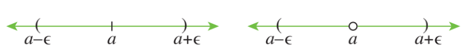
**Figure 1.3**

## 1.5 Relations

We approach the concept of relations in different aspects using real life sense, Cryptography and Geometry through Cartesian product of sets.

In our day to day life very often we come across questions like, "How is he related to you?" Some probable answers are,

(i) He is my father.

(ii) He is my teacher.

(iii) He is not related to me.

From this we see that the word relation connects a person with another person. Extending this idea, in mathematics we consider relations as one which connects mathematical objects. Examples,

(i) A number \( m \) is related to a number \( n \) if \( m \) divides \( n \) in \( \mathbb{N} \)

(ii) A real number \( x \) is related to a real number \( y \) if \( x \leq y \)

(iii) A point \( p \) is related to a line \( L \) if \( p \) lies on \( L \)

(iv) A student \( X \) is related to a school \( S \) if \( X \) is a student of \( S \)

**Illustration 1.1 (Cryptography)**

For centuries, people have used ciphers or codes, to keep confidential information secure. Effective ciphers are essential to the military, to financial institutions and to computer programmers. The study of the techniques used in creating coding and decoding these ciphers is called cryptography.
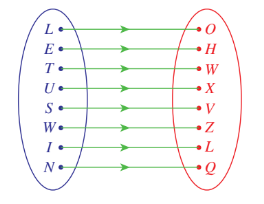
**Figure 1.4**

One of the earliest methods of coding a message was a simple substitution. For example, each letter in a message might be replaced by the letter that appears three places later in the alphabet.

Using this coding scheme, "LET US WIN" becomes "OHW XVZ LQ". This scheme was used by Julius Caesar and is called the Caesar's cipher. To decode, replace each letter by the letter three places before it. This concept is used often in Mental Ability Tests. The above can be represented as an arrow diagram as given in Figure 1.4.

This can be viewed as the set of ordered pairs

$$
\{(L,O),(E,H),(T,W),(U,X),(S,V),(W,Z),(I,L),(N,Q)\}
$$

which is a subset of the Cartesian product \( C \times D \) where \( C = \{L,E,T,U,S,W,I,N\} \) and \( D = \{O,H,W,X,V,Z,L,Q\} \).

**Illustration 1.2 (Geometry)**

Consider the following three equations

(i) \( 2x - y = 0 \)

(ii) \( x^2 - y = 0 \)

(iii) \( x - y^2 = 0 \)

**(i) \( 2x - y = 0 \)**

The equation \( 2x - y = 0 \) represents a straight line. Clearly the points, \( (1,2) \), \( (3,6) \) lie on it whereas \( (1,1) \), \( (3,5) \), \( (4,5) \) are not lying on the straight line. The analytical relation between \( x \) and \( y \) is given by \( y = 2x \). The set of all points that lie on the straight line is given as \( \{(x,2x) : x \in \mathbb{R}\} \). Clearly this is a subset of \( \mathbb{R} \times \mathbb{R} \). (See Figure 1.5.)
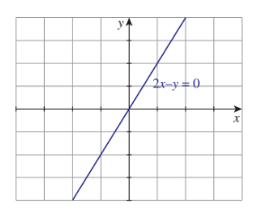

**Figure 1.5**
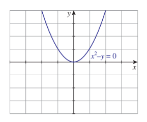

**Figure 1.6**
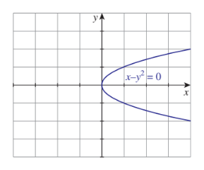

**Figure 1.7**

**(ii) \( x^2 - y = 0 \)**

As we discussed earlier, the relation between \( x \) and \( y \) is \( y = x^2 \). The set of all points on the curve is \( \{(x, x^2) : x \in \mathbb{R}\} \) (See Figure 1.6). Again this is a subset of the Cartesian product \( \mathbb{R} \times \mathbb{R} \).

**(iii) \( x - y^2 = 0 \)**

As above, the relation between \( x \) and \( y \) is \( y^2 = x \) or \( y = \pm \sqrt{x} \), \( x \geq 0 \). The equation can also be re-written as \( y = +\sqrt{x} \) and \( y = -\sqrt{x} \). The set of all points on the curve is the union of the sets \( \{(x, \sqrt{x})\} \) and \( \{(x, -\sqrt{x})\} \), where \( x \) is a non-negative real number, are the subsets of the Cartesian product \( \mathbb{R} \times \mathbb{R} \). (See Figure 1.7).

From the above examples we intuitively understand what a relation is. But in mathematics, we have to give a rigorous definition for each and every technical term we are using. Now let us start defining the term "relation" mathematically.

Let \( A = \{p,q,r,s,t,u\} \) be a set of students and let \( B = \{X,Y,Z,W\} \) be a set of schools. Let us consider the following "relation".

A student \( a \in A \) is related to a school \( S \in B \) if \( a \) is studying or studied in the school \( S \).

Let us assume that

- \( p \) studied in \( X \) and now studying in \( W \)
- \( q \) studied in \( X \) and now studying in \( Y \)
- \( r \) studied in \( X \) and \( W \), and now studying in \( Z \)
- \( s \) has been studying in \( X \) from the beginning
- \( t \) studied in \( Z \) and now studying in no school
- \( u \) never studied in any of these four schools.

Though the relations are given explicitly, it is not possible to give a relation always in this way. So let us try some other representations for expressing the same relation:

(iii) \( \{(p,X), (p,W), (q,X), (q,Y), (r,X), (r,Z), (r,W), (s,X), (t,Z)\} \)

or

\( \{pRX, pRW, qRX, qRY, rRX, rRZ, rRW, sRX, tRZ\} \)

Among these four representations of the relation, the third one seems to be more convenient and comfortable to deal with a relation in terms of sets.

The set given in the third representation is a subset of the Cartesian product \( A \times B \). In Illustrations 1.1 and 1.2 also, we arrived at subsets of a Cartesian product.

### Definition 1.2

Let \( A \) and \( B \) be any two non-empty sets. A **relation** \( R \) from \( A \) to \( B \) is defined as a subset of the Cartesian product of \( A \) and \( B \). Symbolically

$$
R \subseteq A \times B.
$$

A relation from \( A \) to \( B \) is different from a relation from \( B \) to \( A \).

The set

$$
\{a \in A : (a,b) \in R \text{ for some } b \in B\}
$$

is called the **domain** of the relation.

The set

$$
\{b \in B : (a,b) \in R \text{ for some } a \in A\}
$$

is called the **range** of the relation.

Thus the domain of the relation \( R \) is the set of all first coordinates of the ordered pairs and the range of the relation \( R \) is the set of all second coordinates of the ordered pairs.

**Illustration 1.3**

Consider the diagram in Figure 1.8. Here the alphabets are mapped onto the natural numbers. A simple cipher is to assign a natural number to each alphabet. Here \( a \) is represented by 1, \( b \) is represented by 2, ..., \( z \) is represented by 26. This correspondence can be written as the set
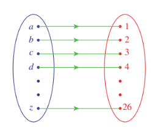

**Figure 1.8**

of ordered pairs \( \{(a,1),(b,2),\ldots,(z,26)\} \). This set of ordered pairs is a relation. The domain of the relation is \( \{a,b,\ldots,z\} \) and the range is \( \{1,2,\ldots,26\} \).

Now we recall that the relations discussed in Illustrations 1.1 and 1.2 also end up with subsets of the cartesian product of two sets. So the term relation used in all discussions we had so far, fits with the mathematical term relation defined in Definition 1.2.

The domain of the relation discussed in Illustration 1.1 is the set \( \{L,E,T,U,S,W,I,N\} \) and the range is \( \{O,H,W,X,V,Z,L,Q\} \). In Illustration 1.2, the domain and range of the relation discussed for the equation \( 2x - y = 0 \) are \( \mathbb{R} \) and \( \mathbb{R} \) (See Figure 1.9); for the equation \( x^2 - y = 0 \), the domain is \( \mathbb{R} \) and the range is \( [0,\infty) \) (See Figure 1.10); and in the case of the third equation \( x - y^2 = 0 \), the domain is \( [0,\infty) \) and the range is \( \mathbb{R} \) (See Figures 1.11 and 1.12).
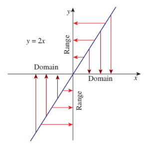

**Figure 1.9**
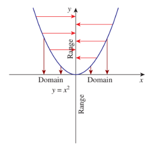

**Figure 1.10**
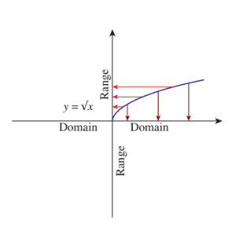

**Figure 1.11**
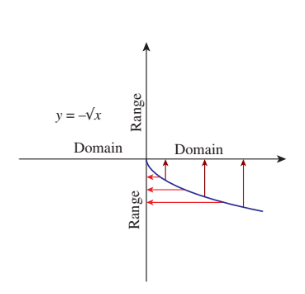

**Figure 1.12**

Note that, the domain of a relation is a subset of the first set in the Cartesian product and the range is a subset of second set. Usually we call the second set as **co-domain** of the relation. Thus, the range of a relation is the collection of all elements in the co-domain which are related to some element in the domain. Let us note that the range of a relation is a subset of the co-domain.

For any set \( A \), \( \emptyset \) and \( A \times A \) are subsets of \( A \times A \). These two relations are called **extreme relations**. The former relation is an **empty relation** and the later is an **universal relation**.

We will discuss more about domain, co-domain and the range in the next section namely, "Functions".

If \( R \) is a relation from \( A \) to \( B \) and if \( (x,y) \in R \), then sometimes we write \( xRy \) (read this as "\( x \) is related to \( y \)") and if \( (x,y) \notin R \), then sometimes we write \( x\not R y \) (read this as "\( x \) is not related to \( y \)").

Though the general definition of a relation is defined from one set to another set, relations defined on a set are of more interest in mathematical point of view. So let us concentrate on relations defined on a set.

### 1.5.1 Types of Relations

Consider the following examples:

(i) Let \( S = \{1,2,3,4\} \) and \( R = \{(1,1),(1,3),(2,3)\} \) on \( S \).

(ii) Let \( S = \{1,2,3,\ldots,10\} \) and define "\( m \) is related to \( n \), if \( m \) divides \( n \)".

(iii) Let \( \mathcal{C} \) be the set of all circles in a plane and define "a circle \( C \) is related to a circle \( C' \), if the radius of \( C \) is equal to the radius of \( C' \)".

(iv) In the set \( S \) of all people define "\( a \) is related to \( b \), if \( a \) is a brother of \( b \)".

(v) Let \( S \) be the set of all people. Define the relation on \( S \) by the rule "mother of".

In the second example, as every number divides itself, "\( a \) is related to \( a \) for all \( a \in S \)"; the same is true in the third relation also. In the first example "\( a \) is related to \( a \) for all \( a \in S \)" is not true as 2 is not related to 2.

It is easy to see that the property "if \( a \) is related to \( b \), then \( b \) is related to \( a \)" is true in the third but not in the second.

It is easy to see that the property "if \( a \) is related to \( b \) and \( b \) is related to \( c \), then \( a \) is related to \( c \)" is true in the second and third relations but not in the fifth.

These properties, together with some more properties are very much studied in mathematical structures. Let us define them now.

### Definition 1.3

Let \( S \) be any non-empty set. Let \( R \) be a relation on \( S \). Then

- \( R \) is said to be **reflexive** if \( a \) is related to \( a \) for all \( a \in S \).
- \( R \) is said to be **symmetric** if \( a \) is related to \( b \) implies that \( b \) is related to \( a \).
- \( R \) is said to be **transitive** if "\( a \) is related to \( b \) and \( b \) is related to \( c \)" implies that \( a \) is related to \( c \).

These three relations are called basic relations.

Let us rewrite the definitions of these basic relations in a different form:

Let \( S \) be any non-empty set. Let \( R \) be a relation on \( S \). Then \( R \) is

- reflexive if \( (a,a) \in R \) for all \( a \in S \)
- symmetric if \( (a,b) \in R \Rightarrow (b,a) \in R \)
- transitive if \( (a,b) \in R \) and \( (b,c) \in R \Rightarrow (a,c) \in R \)

### Definition 1.4

Let \( S \) be any set. A relation on \( S \) is said to be an **equivalence relation** if it is reflexive, symmetric and transitive.

Let us consider the following two relations.

(1) In the set \( S_1 \) of all people, define a relation \( R_1 \) by the rule: "\( a \) is related to \( b \), if \( a \) is a brother of \( b \)."

(2) In the set \( S_2 \) of all males, define a relation \( R_2 \) by the rule: "\( a \) is related to \( b \), if \( a \) is a brother of \( b \)."

The rules that define the relations on \( S_1 \) and \( S_2 \) are the same. But the sets are not same. \( R_1 \) is not a symmetric relation on \( S_1 \) whereas \( R_2 \) is a symmetric relation on \( S_2 \). This shows that not only the rule defining the relation is important, the set on which the relation is defined, is also important. So whenever one considers a relation, both the relation as well as the set on which the relation is defined have to be given explicitly. Note that the relation \( \{(1,1),(2,2),(3,3),(1,2)\} \) is reflexive if it is defined on the set \( \{1,2,3\} \); it is not reflexive if it is defined on the set \( \{1,2,3,4\} \).

1. Let \( X = \{1,2,3,4\} \) and \( R = \{(1,1),(2,1),(2,2),(3,3),(1,3),(4,4),(1,2),(3,1)\} \). As \( (1,1),(2,2),(3,3) \) and \( (4,4) \) are all in \( R \) it is reflexive. Also for each pair \( (a,b) \in R \) the pair \( (b,a) \) is also in \( R \). So \( R \) is symmetric. As \( (2,1),(1,3) \in R \) and \( (2,3) \notin R \), we see that \( R \) is not transitive. Thus \( R \) is not an equivalence relation.

2. Let \( P \) denote the set of all straight lines in a plane. Let \( R \) be the relation defined on \( P \) as \( \ell R m \) if \( \ell \) is parallel to \( m \). This relation is reflexive, symmetric and transitive. Thus it is an equivalence relation.

3. Let \( A \) be the set consist of parents with their children, two girls and a boy. Let \( R \) be the relation defined by \( a R b \) if \( a \) is a sister of \( b \). This relation is to be looked into carefully. A woman is not a sister of herself. So it is not reflexive. It is not symmetric also. Clearly it is not transitive. So it is not an equivalence relation. (If we consider the same relation on the subset of females, then it becomes symmetric; even in this case it is not transitive).

4. On the set of natural numbers let \( R \) be the relation defined by \( x R y \) if \( x + 2y = 21 \). It is better to write the relation explicitly. The relation \( R \) is the set \( \{(1,10),(3,9),(5,8),(7,7),(9,6),(11,5),(13,4),(15,3),(17,2),(19,1)\} \). As \( (1,1) \notin R \) it is not reflexive; as \( (1,10) \in R \) and \( (10,1) \notin R \) it is not symmetric. As \( (3,9) \in R \), \( (9,6) \in R \) but \( (3,6) \notin R \), the relation is not transitive.

5. Let \( X = \{1,2,3,4\} \) and \( R = \emptyset \), where \( \emptyset \) is the empty set. As \( (1,1) \notin R \) it is not reflexive. As we cannot find a pair \( (x,y) \) in \( R \) such that \( (y,x) \notin R \), the relation is not 'not symmetric'; so it is symmetric. Similarly it is transitive.

6. The universal relation is always an equivalence relation.

7. An empty relation can be considered as symmetric and transitive.

8. If a relation contains a single element, then the relation is transitive.

Let us discuss some more special relations now.

### Example 1.10

Check the relation \( R = \{(1,1),(2,2),(3,3),\ldots,(n,n)\} \) defined on the set \( S = \{1,2,3,\ldots,n\} \) for the three basic relations.

**Solution:**

As \( (a,a) \in R \) for all \( a \in S \), \( R \) is reflexive.

There is no pair \( (a,b) \) in \( R \) such that \( (b,a) \notin R \). In other words, for every pair \( (a,b) \in R \), \( (b,a) \) is also in \( R \). Thus \( R \) is symmetric.

We cannot find two pairs \( (a,b) \) and \( (b,c) \) in \( R \), such that \( (a,c) \notin R \). Thus the statement "\( R \) is not transitive" is not true; therefore, the statement "\( R \) is transitive" is true; hence \( R \) is transitive.

Since \( R \) is reflexive, symmetric and transitive, this relation is an equivalence relation.

From the very beginning we have denoted all the relations by the same letter \( R \). It is not necessary to do so. We may use the Greek letter \( \rho \) (Read as rho) to denote relations. Equivalence relations are mostly denoted by "\( \sim \)".

If a relation is not of required type, then by inserting or deleting some pairs we can make it of the required type. We do this in the following problem.

### Example 1.11

Let \( S = \{1,2,3\} \) and \( \rho = \{(1,1),(1,2),(2,2),(1,3),(3,1)\} \).

(i) Is \( \rho \) reflexive? If not, state the reason and write the minimum set of ordered pairs to be included to \( \rho \) so as to make it reflexive.

(ii) Is \( \rho \) symmetric? If not, state the reason, write minimum number of ordered pairs to be included to \( \rho \) so as to make it symmetric and write minimum number of ordered pairs to be deleted from \( \rho \) so as to make it symmetric.

(iii) Is \( \rho \) transitive? If not, state the reason, write minimum number of ordered pairs to be included to \( \rho \) so as to make it transitive and write minimum number of ordered pairs to be deleted from \( \rho \) so as to make it transitive.

(iv) Is \( \rho \) an equivalence relation? If not, write the minimum ordered pairs to be included to \( \rho \) so as to make it an equivalence relation.

**Solution:**

(i) \( \rho \) is not reflexive because \( (3,3) \) is not in \( \rho \). As \( (1,1) \) and \( (2,2) \) are in \( \rho \), it is enough to include the pair \( (3,3) \) to \( \rho \) so as to make it reflexive.

(ii) \( \rho \) is not symmetric because \( (1,2) \) is in \( \rho \), but \( (2,1) \) is not in \( \rho \). It is enough to include the pair \( (2,1) \) to \( \rho \) so as to make it symmetric.

It is enough to remove the pair \( (1,2) \) from \( \rho \) so as to make it symmetric.

(iii) \( \rho \) is not transitive because \( (3,1) \) and \( (1,3) \) are in \( \rho \), but \( (3,3) \) is not in \( \rho \). To make it transitive we have to include \( (3,3) \) in \( \rho \). Even after including \( (3,3) \), the relation is not transitive because \( (3,1) \) and \( (1,2) \) are in \( \rho \), but \( (3,2) \) is not in \( \rho \). To make it transitive we have to include \( (3,2) \) also in \( \rho \). Now it becomes transitive. So \( (3,3) \) and \( (3,2) \) are to be included so as to make \( \rho \) transitive.

But if we remove \( (3,1) \) from \( \rho \), then it becomes transitive.

(iv) We have seen that

- to make \( \rho \) reflexive, we have to include \( (3,3) \)
- to make \( \rho \) symmetric, we have to include \( (2,1) \)
- to make \( \rho \) transitive, we have to include \( (3,3) \) and \( (3,2) \)

To make \( \rho \) as an equivalence relation we have to include all these pairs. So after including the pairs the relation becomes

$$
\{(1,1),(2,2),(3,3),(1,2),(2,1),(1,3),(3,1),(3,2)\}
$$

But this relation is not symmetric because \( (3,2) \) is in the relation and \( (2,3) \) is not in the relation. So we have to include \( (2,3) \) also. Now the new relation becomes

$$
\{(1,1),(2,2),(3,3),(1,2),(2,1),(1,3),(3,1),(3,2),(2,3)\}
$$

It can be seen that this relation is reflexive, symmetric and transitive, and hence it is an equivalence relation. Thus we have to include \( (3,3), (2,1), (3,2) \) and \( (2,3) \) to \( \rho \) so as to make it an equivalence relation.

Now let us learn how to create relations having certain properties through the following example.

### Example 1.12

Let \( A = \{0,1,2,3\} \). Construct relations on \( A \) of the following types:

(i) not reflexive, not symmetric, not transitive.

(ii) not reflexive, not symmetric, transitive.

(iii) not reflexive, symmetric, not transitive.

(iv) not reflexive, symmetric, transitive.

(v) reflexive, not symmetric, not transitive.

(vi) reflexive, not symmetric, transitive.

(vii) reflexive, symmetric, not transitive.

(viii) reflexive, symmetric, transitive.

**Solution:**

(i) Let us use the pair \( (1,2) \) to make the relation "not symmetric" and consider the relation \( \{(1,2)\} \). It is transitive. If we include \( (2,3) \) and not include \( (1,3) \), then the relation is not transitive. So the relation \( \{(1,2),(2,3)\} \) is not reflexive, not symmetric and not transitive. Similarly we can construct more examples.

(ii) Just now we have seen that the relation \( \{(1,2)\} \) is transitive, not reflexive and not symmetric.

(iii) Let us start with the pair \( (1,2) \). Since we need symmetricity, we have to include the pair \( (2,1) \). At this stage as \( (1,1),(2,2) \) are not here, the relation is not transitive. Thus \( \{(1,2),(2,1)\} \) is not reflexive; it is symmetric; and it is not transitive.

(iv) If we include the pairs \( (1,1) \) and \( (2,2) \) to the relation discussed in (iii), it will become transitive. Thus \( \{(1,2),(2,1),(1,1),(2,2)\} \) is not reflexive; it is symmetric and it is transitive.

(v) For a relation on \( \{0,1,2,3\} \) to be reflexive, it must have the pairs \( (0,0),(1,1),(2,2),(3,3) \). Fortunately, it becomes symmetric and transitive. Therefore, as in (i) if we insert \( (1,2) \) and \( (2,3) \) we get the required one. Thus \( \{(0,0),(1,1),(2,2),(3,3),(1,2),(2,3)\} \) is reflexive; it is not symmetric and it is not transitive.

(vi) Proceeding like this we get the relation \( \{(0,0),(1,1),(2,2),(3,3),(1,2)\} \) that is reflexive, transitive and not symmetric.

(vii) As above we get the relation \( \{(0,0),(1,1),(2,2),(3,3),(1,2),(2,3),(2,1),(3,2)\} \) that is reflexive, symmetric and not transitive.

(viii) We have the relation \( \{(0,0),(1,1),(2,2),(3,3)\} \) which is reflexive, symmetric and transitive.

### Example 1.13

In the set \( \mathbb{Z} \) of integers, define \( mRn \) if \( m - n \) is a multiple of 12. Prove that \( R \) is an equivalence relation.

**Solution:**

As \( m - m = 0 \) and \( 0 = 0 \times 12 \), hence \( mRm \) proving that \( R \) is reflexive.

Let \( mRn \). Then \( m - n = 12k \) for some integer \( k \); thus \( n - m = 12(-k) \) and hence \( nRm \). This shows that \( R \) is symmetric.

Let \( mRn \) and \( nRp \); then \( m - n = 12k \) and \( n - p = 12\ell \) for some integers \( k \) and \( \ell \).

So \( m - p = 12(k + \ell) \) and hence \( mRp \). This shows that \( R \) is transitive.

Thus \( R \) is an equivalence relation.

### Theorem 1.1

The number of relations from a set containing \( m \) elements to a set containing \( n \) elements is \( 2^{mn} \). In particular the number of relations on a set containing \( n \) elements is \( 2^{n^2} \).

**Proof.** Let \( A \) and \( B \) be sets containing \( m \) and \( n \) elements respectively. Then \( A \times B \) contains \( mn \) elements and \( A \times B \) has \( 2^{mn} \) subsets. Since every subset of \( A \times B \) is a relation from \( A \) to \( B \), there are \( 2^{mn} \) relations from a set containing \( m \) elements to a set containing \( n \) elements.

Taking \( A = B \), we see that the number of relations on a set containing \( n \) elements is \( 2^{n^2} \).

(i) The number of reflexive relations on a set containing \( n \) elements is \( 2^{n^2 - n} \).

(ii) The number of symmetric relations on a set containing \( n \) elements is \( 2^{\frac{n^2 + n}{2}} \).

### Definition 1.5

If \( R \) is a relation from \( A \) to \( B \), then the relation \( R^{-1} \) defined from \( B \) to \( A \) by

$$
R^{-1} = \{(b,a) : (a,b) \in R\}
$$

is called the **inverse** of the relation \( R \).

For example, let \( R = \{(1,a),(2,b),(2,c),(3,a)\} \). Then

$$
R^{-1} = \{(a,1),(b,2),(c,2),(a,3)\}.
$$

It is easy to see that the domain of \( R \) becomes the range of \( R^{-1} \) and the range of \( R \) becomes the domain of \( R^{-1} \).

An equivalence relation on a set decomposes it into a disjoint union of its subsets (equivalence classes). Such a decomposition is called a **partition**. This is explained in the following example.

For \( a,b \in \mathbb{Z} \), \( aRb \) if and only if \( a - b = 3k \), \( k \in \mathbb{Z} \) is an equivalence relation on \( \mathbb{Z} \).

We have

$$
\mathbb{Z} = Z_0 \cup Z_1 \cup Z_2
$$

where \( Z_0 = \{ \ldots, -6, -3, 0, 3, 6, \ldots \} \), \( Z_1 = \{ \ldots, -5, -2, 1, 4, 7, \ldots \} \) and \( Z_2 = \{ \ldots, -4, -1, 2, 5, 8, \ldots \} \). Thus \( \mathbb{Z} = Z_0 \cup Z_1 \cup Z_2 \) and all are disjoint subsets.

For a given partition \( S_1 \cup S_2 \cup \dots \cup S_n \) of a set \( S \) into disjoint subsets, one can construct an equivalence relation \( R \) on \( S \) by \( xRy \) if \( x,y \in S_i \) for some \( i \).

Equivalence relation is used in almost all branches of higher mathematics.

## Exercise 1.2

1. Discuss the following relations for reflexivity, symmetricity and transitivity:

   (i) The relation \( R \) defined on the set of all positive integers by "\( mRn \) if \( m \) divides \( n \)"

   (ii) Let \( P \) denote the set of all straight lines in a plane. The relation \( R \) defined by "\( \ell R m \) if \( \ell \) is perpendicular to \( m \)"

   (iii) Let \( A \) be the set consisting of all the members of a family. The relation \( R \) defined by "\( aRb \) if \( a \) is not a sister of \( b \)"

   (iv) Let \( A \) be the set consisting of all the female members of a family. The relation \( R \) defined by "\( aRb \) if \( a \) is not a sister of \( b \)"

   (v) On the set of natural numbers the relation \( R \) defined by "\( xRy \) if \( x + 2y = 1 \)"

2. Let \( X = \{a,b,c,d\} \) and \( R = \{(a,a),(b,b),(a,c)\} \). Write down the minimum number of ordered pairs to be included to \( R \) to make it

   (i) reflexive

   (ii) symmetric

   (iii) transitive

   (iv) equivalence

3. Let \( A = \{a,b,c\} \) and \( R = \{(a,a),(b,b),(a,c)\} \). Write down the minimum number of ordered pairs to be included to \( R \) to make it

   (i) reflexive

   (ii) symmetric

   (iii) transitive

   (iv) equivalence

4. Let \( P \) be the set of all triangles in a plane and \( R \) be the relation defined on \( P \) as \( aRb \) if \( a \) is similar to \( b \). Prove that \( R \) is an equivalence relation.

5. On the set of natural numbers let \( R \) be the relation defined by \( aRb \) if \( 2a + 3b = 30 \). Write down the relation by listing all the pairs. Check whether it is

   (i) reflexive

   (ii) symmetric

   (iii) transitive

   (iv) equivalence

6. Prove that the relation "friendship" is not an equivalence relation on the set of all people in Chennai.

7. On the set of natural numbers let \( R \) be the relation defined by \( aRb \) if \( a + b \leq 6 \). Write down the relation by listing all the pairs. Check whether it is

   (i) reflexive

   (ii) symmetric

   (iii) transitive

   (iv) equivalence

8. Let \( A = \{a,b,c\} \). What is the equivalence relation of smallest cardinality on \( A \)? What is the equivalence relation of largest cardinality on \( A \)?

9. In the set \( \mathbb{Z} \) of integers, define \( mRn \) if \( m - n \) is divisible by 7. Prove that \( R \) is an equivalence relation.

## 1.6 Functions

Suppose that a particle is moving in the space. We assume the physical particle as a point. As time varies, the particle changes its position. Mathematically at any time the point occupies a position in the three dimensional space \( \mathbb{R}^3 \). Let us assume that the time varies from 0 to 1. So the movement or functioning of the particle decides the position of the particle at any given time \( t \) between 0 and 1. In other words, for each \( t \in [0,1] \), the functioning of the particle gives a point in \( \mathbb{R}^3 \). Let us denote the position of the particle at time \( t \) as \( f(t) \).

Let us see another simple example. We know that the equation \( 2x - y = 0 \) describes a straight line. Here whenever \( x \) assumes a value, \( y \) assumes some value accordingly. The movement or functioning of \( y \) is decided by that of \( x \). Let us denote \( y \) by \( f(x) \). We may see many situation like this in nature. In the study of natural phenomena, we find that it is necessary to consider the variation of one quantity depending on the variation of another.

The relation of the time and the position of the particle, the relation of a point in the \( x \)-axis to a point in the \( y \)-axis and many more such relations are studied for a very long period in the name function. Before Cantor, the term function is defined as a rule which associates a variable with another variable. After the development of the concept of sets, a function is defined as a rule that associates for every element in a set \( A \), a unique element in a set \( B \). However the terms rule and associate are not properly defined mathematical terminologies. In modern mathematics every term we use has to be defined properly. So a definition for function is given using relations.

Suppose that we want to discuss a test written by a set of students. We shall see this as a relation.

Let \( A \) be the set of students appeared for an examination and let \( B = \{0,1,2,3,\ldots,100\} \) be the set of possible marks. We define a relation \( R \) as follows:

A student \( a \) is related to a mark \( b \) if \( a \) got \( b \) marks in the test.

We observe the following from this example:

- Every student got a mark. In other words, for every \( a \in A \), there is an element \( b \in B \) such that \( (a,b) \in R \).
- A student cannot get two different marks in any test. In other words, for every \( a \in A \), there is definitely only one \( b \in B \) such that \( (a,b) \in R \). This can be restated in a different way: If \( (a,b), (a,c) \in R \) then \( b = c \).

Relations having the above two properties form a very important class of relations, called functions. Let us now have a rigorous definition of a function through relations.

### Definition 1.6

Let \( A \) and \( B \) be two sets. A relation \( f \) from \( A \) to \( B \), a subset of \( A \times B \), is called a **function** from \( A \) to \( B \) if it satisfies the following:

(i) for all \( a \in A \), there is an element \( b \in B \) such that \( (a,b) \in f \).

(ii) if \( (a,b) \in f \) and \( (a,c) \in f \) then \( b = c \).

That is, a function is a relation in which each element in the domain is mapped to exactly one element in the range.

\( A \) is called the **domain** of \( f \) and \( B \) is called the **co-domain** of \( f \). If \( (a,b) \) is in \( f \), then we write \( f(a) = b \); the element \( b \) is called the **image** of \( a \) and the element \( a \) is called a **pre-image** of \( b \) and \( f(a) \) is known as the **value** of \( f \) at \( a \). The set \( \{b : (a,b) \in f \text{ for some } a \in A\} \) is called the **range** of the function. If \( B \) is a subset of \( \mathbb{R} \), then we say that the function is a **real-valued function**.

Two functions \( f \) and \( g \) are said to be equal functions if their domains are same and \( f(a) = g(a) \) for all \( a \) in the domain.

If \( f \) is a function with domain \( A \) and co-domain \( B \), we write \( f : A \to B \) (Read this as \( f \) is from \( A \) to \( B \) or \( f \) be a function from \( A \) to \( B \)). We also say that \( f \) maps \( A \) into \( B \). If \( f(a) = b \), then we say \( f \) maps \( a \) to \( b \) or \( a \) is mapped onto \( b \) by \( f \), and so on.

The range of a function is the collection of all elements in the co-domain which have pre-images. Clearly the range of a function is a subset of the co-domain. Further the first condition says that every element in the domain must have an image; this is the reason for defining the domain of a relation \( R \) from a set \( A \) to a set \( B \) as the set of all elements of \( A \) having images and not as \( A \). The second condition says that an element in the domain cannot have two or more images.

Naturally one may have the following doubts:

- In the definition, why we use the definite article "the" for image of \( a \) and the indefinite article "a" for pre-image of \( b \)?
- We have a condition stating that every element in the domain must have an image; is there any condition like "every element in the co-domain must have a pre-image"? If not, why?
- We have a condition stating that an element in the domain cannot have two or more pre-images? If not, why?

As an element in the domain has exactly one image and an element in the co-domain can have more than one pre-image according to the definition, we use the definite article "the" for image of \( a \) and the indefinite article "a" for pre-image of \( b \). There are no conditions as asked in the other two questions; the reason behind it can be understood from the problem of students' mark we considered above.

We observe that every function is a relation but a relation need not be a function.

Let \( f = \{(a,1),(b,2),(c,2),(d,4)\} \)

Is \( f \) a function? This is a function from the set \( \{a,b,c,d\} \) to \( \{1,2,4\} \). This is not a function from \( \{a,b,c,d,e\} \) to \( \{1,2,3,4\} \) because \( e \) has no image. This is not a function from \( \{a,b,c,d\} \) to \( \{1,2,3,5\} \) because the image of \( d \) is not in the co-domain; \( f \) is not a subset of \( \{a,b,c,d\} \times \{1,2,3,5\} \). So whenever we consider a function the domain and the co-domain must be stated explicitly.

The relation discussed in Illustration 1.1 is a function with domain \( \{L,E,T,U,S,W,I,N\} \) and co-domain \( \{O,H,W,X,V,Z,L,Q\} \). The relation discussed in Illustration 1.3 is again a function with domain \( \{a,b,\ldots,z\} \) and the co-domain \( \{1,2,3,\ldots,26\} \).

In Illustration 1.2, we discussed three relations, namely

(i) \( y = 2x \)

(ii) \( y = x^2 \)

(iii) \( y^2 = x \).

Clearly (i) and (ii) are functions whereas (iii) is not a function, if the domain and the co-domain are \( \mathbb{R} \). In (iii) for the same \( x \), we have two \( y \) values which contradict the definition of the function. But if we split into two relations, that is, \( y = \sqrt{x} \) and \( y = -\sqrt{x} \) then both become functions with same domain non-negative real numbers and the co-domains \( [0,\infty) \) and \( (-\infty,0] \) respectively.

### 1.6.1 Ways of Representing Functions

#### (a) Tabular Representation of a Function

When the elements of the domain are listed like \( x_1, x_2, x_3, \ldots, x_n \) we can use this tabular form. Here, the values of the arguments \( x_1, x_2, x_3, \ldots, x_n \) and the corresponding values of the function \( y_1, y_2, y_3, \ldots, y_n \) are written out in a definite order.

| \( x \) | \( x_1 \) | \( x_2 \) | \( \ldots \) | \( x_n \) |
|--------|----------|----------|------------|----------|
| \( y \) | \( y_1 \) | \( y_2 \) | \( \ldots \) | \( y_n \) |

#### (b) Graphical Representation of a Function

When the domain and the co-domain are subsets of \( \mathbb{R} \), many functions can be represented using a graph with \( x \)-axis representing the domain and \( y \)-axis representing the co-domain in the \( (x,y) \)-plane.

Figures 1.5 and 1.6 represent the functions \( f(x) = 2x \) and \( f(x) = x^2 \) respectively. Usually the variable \( x \) is treated as independent variable and \( y \) as a dependent variable. The variable \( x \) is called the argument and \( f(x) \) is called the value.

#### (c) Analytical Representation of a Function

If the functional relation \( y = f(x) \) is such that \( f \) denotes an analytical expression, we say that the function \( y \) of \( x \) is represented or defined analytically. Some examples of analytical expressions are

$$
x^3 + 5, \quad \frac{\sin x + \cos x}{x^2 + 1}, \quad \log x + 5\sqrt{x}.
$$

That is, a series of symbols denoting certain mathematical operations that are performed in a definite sequence on numbers, letters which designate constants or variable quantities.

Examples of functions defined analytically are

(i) \( y = \frac{x - 1}{x + 1} \)

(ii) \( y = \sqrt{9 - x^2} \)

(iii) \( y = \sin x + \cos x \)

(iv) \( A = \pi r^2 \)

One of the usages of writing functions analytically is finding domains naturally. That is, the set of values of \( x \) for which the analytical expressions on the right-hand side has a definite value is the natural domain of definition of a function represented analytically.

Thus, the natural domain of the function \( f(x) = \frac{\sqrt{x + 1}}{x^2 - 1} \) is \( [-1,\infty) - \{-1,1\} \).

Now recall the domain of the functions (i) \( y = 2x \), (ii) \( y = x^2 \), (iii) \( y = +\sqrt{x} \), (iv) \( y = -\sqrt{x} \) which are analytical in nature described earlier.

Sometimes we may come across piece-wise defined functions. For example, consider the function \( f : \mathbb{R} \to \mathbb{R} \) defined as

$$
f(x) = \begin{cases}
x^2, & \text{if } x < -3 \\
2x, & \text{if } -3 \leq x < 3 \\
x^2, & \text{if } 3 \leq x
\end{cases}
$$

Depending upon the value of \( x \), we have to select the formula to be used to find the value of \( f \) at any point \( x \). To find the value of \( f \) at any real number, first we have to find to which interval \( x \) belongs to; then using the corresponding formula we can find the value of \( f \) at that point. To find \( f(6) \) we know \( 3 \leq 6 < \infty \) (or \( 6 \in [3,\infty) \)); so we use the formula \( f(x) = x^2 \) and find \( f(6) = 36 \). Similarly \( f(-1) = -2 \), \( f(-5) = 0 \) and so on.

If the function is defined from \( \mathbb{R} \) or a subset of \( \mathbb{R} \) then we can draw the graph of the function. For example, if \( f : [0,4] \to \mathbb{R} \) is defined by \( f(x) = \frac{x}{2} + 1 \), then we can plot the points \( (x, \frac{x}{2} + 1) \) for all \( x \in [0,4] \). Then we will get a straight line segment joining \( (0,1) \) and \( (4,3) \). (See Figure 1.13)
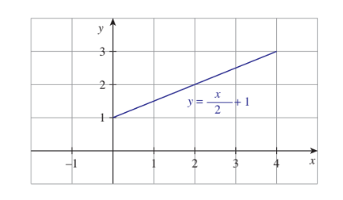

**Figure 1.13**
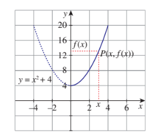

**Figure 1.14**

Consider another function \( f(x) = x^2 + 4, x \geq 0 \). The function will be given by its graph. (See Figure 1.14)

Let \( x \) be a point in the domain. Let us draw a vertical line through the point \( x \). Let it meet the curve at \( P \). The point at which the horizontal line drawn through \( P \) meets the \( y \)-axis is \( f(x) \). Similarly using horizontal lines through a point \( y \) in the co-domain, we can find the pre-images of \( y \).

Can we say that any curve drawn on the plane be considered as a function from a subset of \( \mathbb{R} \) to \( \mathbb{R} \)? No, we cannot. There is a simple test to find this.

### Vertical Line Test

As we noted earlier, the vertical line through any point \( x \) in the domain meets the curve at some point, then the \( y \)-coordinate of the point is \( f(x) \). If the vertical line through a point \( x \) in the domain meets the curve at more than one point, we will get more than one value for \( f(x) \) for one \( x \). This is not allowed in a function. Further, if the vertical line through a point \( x \) in the domain does not meet the curve, then there will be no image for \( x \); this is also not possible in a function. So we can say,

"if the vertical line through a point \( x \) in the domain meets the curve at more than one point or does not meet the curve, then the curve will not represent a function".
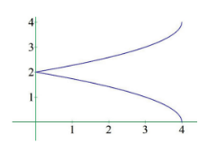

**Figure 1.15**

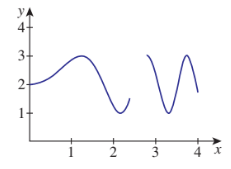

**Figure 1.16**
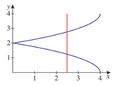

**Figure 1.17**
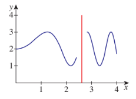

**Figure 1.18**

The curve indicated in Figure 1.15 does not represent a function from \( [0,4] \) to \( \mathbb{R} \) because a vertical line meets the curve at more than one point (See Figure 1.17). The curve indicated in Figure 1.16 does not represent a function from \( [0,4] \) to \( \mathbb{R} \) because a vertical line drawn through \( x = 2.5 \) in \( [0,4] \) does not meet the curve (See Figure 1.18).

Testing whether a given curve represents a function or not by drawing vertical lines is called **vertical line test** or simply vertical test.

The third curve \( y^2 = x \) in Illustration 1.2 fails in the vertical line test and hence it is not a function from \( \mathbb{R} \) to \( \mathbb{R} \).

### 1.6.2 Some Elementary Functions

Some frequently used functions are known by names. Let us list some of them.

(i) Let \( X \) be any non-empty set. The function \( f : X \to X \) defined by \( f(x) = x \) for all \( x \in X \) is called the **identity function** on \( X \) (See Figure 1.19). It is denoted by \( I_X \) or \( I \).
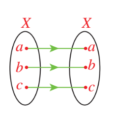

**Figure 1.19**
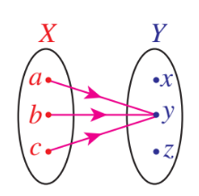

**Figure 1.20**

(ii) Let \( X \) and \( Y \) be two sets. Let \( c \) be a fixed element of \( Y \). The function \( f : X \to Y \) defined by \( f(x) = c \) for all \( x \in X \) is called a **constant function** (See Figure 1.20). The value of a constant function is same for all values of \( x \) throughout the domain. If \( X \) and \( Y \) are \( \mathbb{R} \), then the graph of the identity function and a constant function are as in Figures 1.21 and 1.22. If \( X \) is any set, then the constant function defined by \( f(x) = 0 \) for all \( x \) is called the **zero function**. So zero function is a particular case of constant function.
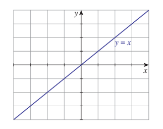

**Figure 1.21**
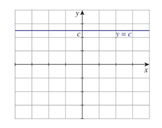

**Figure 1.22**

(iii) The function \( f : \mathbb{R} \to \mathbb{R} \) defined by \( f(x) = |x| \), where \( |x| \) is the modulus or absolute value of \( x \), is called the **modulus function** or **absolute value function**. (See Figure 1.23.) Let us recall that \( |x| \) is defined as

$$
|x| = \begin{cases}
x, & \text{if } x \geq 0 \\
-x, & \text{if } x < 0
\end{cases}
$$
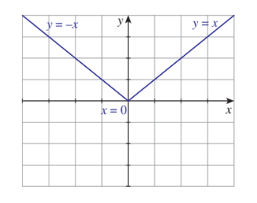

**Figure 1.23**
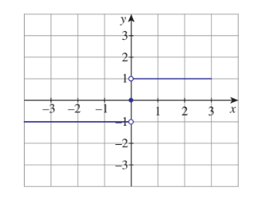

**Figure 1.24**

(iv) The function \( f : \mathbb{R} \to \mathbb{R} \) defined by

$$
f(x) = \begin{cases}
\frac{x}{|x|}, & \text{if } x \neq 0 \\
0, & \text{if } x = 0
\end{cases}
$$

is called the **signum function**. This function is denoted by \( \text{sgn} \). (See Figure 1.24)

(v) The function \( f : \mathbb{R} \to \mathbb{R} \) defined by \( f(x) \) is the greatest integer less than or equal to \( x \) is called the **integral part function** or the **greatest integer function** or the **floor function**. This function is denoted by \( \lfloor x \rfloor \). (See Figure 1.25.)

(vi) The function \( f : \mathbb{R} \to \mathbb{R} \) defined by \( f(x) \) is the smallest integer greater than or equal to \( x \) is called the **smallest integer function** or the **ceil function** (See Figure 1.26.). This function is denoted by \( \lceil \cdot \rceil \); that is \( f(x) \) is denoted by \( \lceil x \rceil \).

The functions (v) and (vi) are also called **step functions**.

Let us note that

\[
\lfloor 1\frac{1}{5} \rfloor = 1, \quad \lceil 7.23 \rceil = 7, \quad \lfloor -2\frac{1}{2} \rfloor = -3 \ (\text{not } -2), \quad [6] = 6, \quad \lfloor -4 \rfloor = -4.
\]

\[
\lceil 1\frac{1}{5} \rceil = 2, \quad \lceil 7.23 \rceil = 8, \quad \lceil -2\frac{1}{2} \rceil = -2 \ (\text{not } -3), \quad [6] = 6, \quad \lceil -4 \rceil = -4.
\]
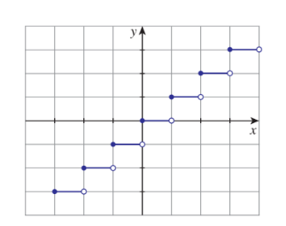
**Figure 1.2**

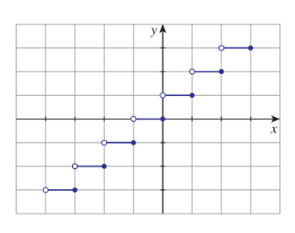
**Figure 1.26**

### 1.6.3 Types of Functions

Though functions can be classified into various types according to the need, we are going to concentrate on two basic types: one-to-one functions and onto functions.
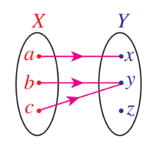

**Figure 1.27**
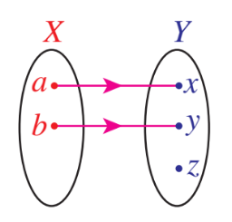

**Figure 1.28**
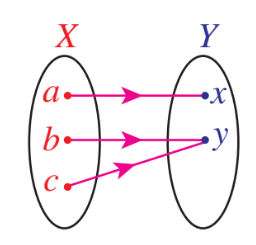

**Figure 1.29**

Let us look at the two simple functions given in Figure 1.27 and Figure 1.28. In the first function two elements of the domain, \( b \) and \( c \) are mapped into the same element \( y \) whereas it is not the case in the Figure 1.28. Functions like the second one are examples of one-to-one functions.

Let us look at the two functions given in Figures 1.28 and 1.29. In Figure 1.28 the element \( z \) in the co-domain has no pre-image, whereas it is not the case in Figure 1.29. Functions like in Figure 1.29 are examples of onto functions. Now we define one-to-one and onto functions.

### Definition 1.7

A function \( f : A \to B \) is said to be **one-to-one** if \( x, y \in A, x \neq y \Rightarrow f(x) \neq f(y) \) [or equivalently \( f(x) = f(y) \Rightarrow x = y \)].

A function \( f : A \to B \) is said to be **onto**, if for each \( b \in B \) there exists at least one element \( a \in A \) such that \( f(a) = b \). That is, the range of \( f \) is \( B \).

Another name for one-to-one function is **injective** function; onto function is **surjective** function. A function \( f : A \to B \) is said to be **bijective** if it is both one-to-one and onto.

To prove a function \( f : A \to B \) to be one-to-one, it is enough to prove any one of the following:

if \( x \neq y \), then \( f(x) \neq f(y) \), or equivalently if \( f(x) = f(y) \), then \( x = y \).

It is easy to observe that every identity function is one-to-one function as well as onto. A constant function is not onto unless the co-domain contains only one element.

The following statements are some important simple results. Let \( A \) and \( B \) be two sets with \( m \) and \( n \) elements.

(i) There is no one-to-one function from \( A \) to \( B \) if \( m > n \)

(ii) If there is a one-to-one function from \( A \) to \( B \), then \( m \leq n \)

(iii) There is no onto function from \( A \) to \( B \) if \( m < n \)

(iv) If there is an onto function from \( A \) to \( B \), then \( m \geq n \)

(v) There is a bijection from \( A \) to \( B \), if and only if, \( m = n \)

(vi) There is no bijection from \( A \) to \( B \) if and only if, \( m \neq n \)

A function which is not onto is called an **into** function. That is, the range of the function is a proper subset of its co-domain. Let us see some illustrations.

(1) \( X = \{1,2,3,4\} \), \( Y = \{a,b,c,d,e\} \) and \( f = \{(1,a),(2,c),(3,e),(4,b)\} \). This function is one-to-one but not onto.

(2) \( X = \{1,2,3,4\} \), \( Y = \{a,b\} \) and \( f = \{(1,a),(2,a),(3,a),(4,a)\} \). This function is not one-to-one; it is not onto.

(3) \( X = \{1,2,3,4\} \), \( Y = \{a\} \) and \( f = \{(1,a),(2,a),(3,a),(4,a)\} \). This function is not one-to-one but it is not onto. It seems that this function is same as the previous one. The co-domain of the function is very important when deciding whether the function is onto or not.

(4) \( X = \{1,2,3,4\} \), \( Y = \{a,b,c,d,e\} \) and \( f = \{(1,a),(2,c),(3,b),(4,b)\} \). This function is neither one-to-one nor onto.

(5) \( X = \{1,2,3,4\} \), \( Y = \{a,b,c,d\} \) and \( f = \{(1,a),(2,c),(3,d),(4,b)\} \). This function is both one-to-one and onto.

(6) \( X = \{1,2,3,4\} \), \( Y = \{a,b,c,d,e\} \) and \( f = \{(1,a),(2,c),(3,e)\} \). This is not at all a function, only a relation.

(7) Let \( X \) be a finite set with \( k \) elements. Then, we have a bijection from \( X \) to \( \{1,2,\ldots,k\} \). Let us consider functions defined on some known sets through a formula rule.

### Example 1.14

Check whether the following functions are one-to-one and onto.

(i) \( f : \mathbb{N} \to \mathbb{N} \) defined by \( f(n) = n + 2 \)

(ii) \( f : \mathbb{N} \cup \{-1,0\} \to \mathbb{N} \) defined by \( f(n) = n + 2 \)

**Solution:**

(i) If \( f(n) = f(m) \), then \( n + 2 = m + 2 \) and hence \( m = n \). Thus \( f \) is one-to-one. As 1 has no pre-image, this function is not onto. (See Figure 1.30)

(ii) As above, this function is one-to-one. If \( m \) is in the co-domain, then \( m - 2 \) is in the domain and \( f(m - 2) = (m - 2) + 2 = m \); thus \( m \) has a pre-image and hence this function is onto. (See Figure 1.31)
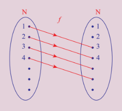

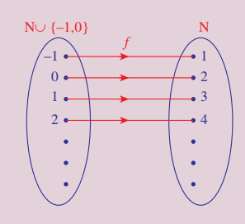

### Example 1.15

If \( f : \mathbb{R} \to \mathbb{R} \) is defined by \( f(x) = 2x^3 \), check whether the function is one-to-one and onto.

**Solution:**

Let \( f(x_1) = f(x_2) \). Then \( 2x_1^3 = 2x_2^3 \) gives \( x_1^3 = x_2^3 \). Since cube root is unique in \( \mathbb{R} \), we get \( x_1 = x_2 \). Thus \( f \) is one-to-one.

Now for any \( y \in \mathbb{R} \) we have \( \sqrt[3]{\frac{y}{2}} \in \mathbb{R} \) and \( f\left(\sqrt[3]{\frac{y}{2}}\right) = 2\left(\sqrt[3]{\frac{y}{2}}\right)^3 = y \). Hence \( f \) is onto.

Thus \( f \) is a bijection.

### Example 1.16

If \( f : \mathbb{N} \to \mathbb{Z} \) defined by \( f(n) = \begin{cases} \frac{n-1}{2}, & \text{if } n \text{ is odd} \\ -\frac{n}{2}, & \text{if } n \text{ is even} \end{cases} \). Find whether the function is one-to-one and onto.

**Solution:**

For some natural numbers, we have

\[
f(1) = 0, f(2) = -1, f(3) = 1, f(4) = -2, f(5) = 2, f(6) = -3, \ldots
\]

It is clear that \( f \) is one-to-one [since \( a \) odd, \( b \) odd, \( f(a) = f(b) \) gives \( a = b \); \( a \) even, \( b \) even, \( f(a) = f(b) \) gives \( a = b \); \( a \) odd, \( b \) even, \( f(a) > 0 \) and \( f(b) \leq 0 \) so they are not equal] and onto (for any integer, we can find a pre-image). So \( f \) is a bijection.

### Example 1.17

If \( f : \mathbb{R} - \{-1,1\} \to \mathbb{R} \) is defined by \( f(x) = \frac{x}{x^2 - 1} \), verify whether \( f \) is one-to-one or not.

**Solution:**

We start with the assumption \( f(x) = f(y) \). Then,

$$
\frac{x}{x^2 - 1} = \frac{y}{y^2 - 1}
$$

$$
\Rightarrow x(y^2 - 1) = y(x^2 - 1)
$$

$$
\Rightarrow xy^2 - x = x^2y - y
$$

$$
\Rightarrow xy^2 - x^2y = x - y
$$

$$
\Rightarrow xy(y - x) = -(y - x)
$$

$$
\Rightarrow (y - x)(xy + 1) = 0
$$

This implies that \( x = y \) or \( xy = -1 \). So if we select two numbers \( x \) and \( y \) so that \( xy = -1 \), then \( f(x) = f(y) \). \( (2, -\frac{1}{2}) \), \( (7, -\frac{1}{7}) \), \( (-2, \frac{1}{2}) \) are some among the infinitely many possible pairs. Thus \( f(2) = f(\frac{-1}{2}) = \frac{2}{3} \). That is, \( f(x) = f(y) \) does not imply \( x = y \). Hence it is not one-to-one.

### Example 1.18

If \( f : \mathbb{R} \to \mathbb{R} \) is defined as \( f(x) = 2x^2 - 1 \), find the pre-images of 17, 4 and \( -2 \).

**Solution:**

To find the pre-image of 17, we solve the equation \( 2x^2 - 1 = 17 \). The two solutions of this equation, \( 3 \) and \( -3 \) are the pre-images of 17 under \( f \). The equation \( 2x^2 - 1 = 4 \) yields \( \sqrt{\frac{5}{2}} \) and \( -\sqrt{\frac{5}{2}} \) as the two pre-images of 4. To find the pre-image of \( -2 \), we solve the equation \( 2x^2 - 1 = -2 \). This shows that \( x^2 = -\frac{1}{2} \) which has no solution in \( \mathbb{R} \) because square of a number cannot be negative and hence \( -2 \) has no pre-image under \( f \).

### Example 1.19

If \( f : [-2,2] \to B \) is given by \( f(x) = 2x^3 \), then find \( B \) so that \( f \) is onto.

**Solution:**

The minimum value is \( f(-2) \) and its maximum value is \( f(2) \) which are equal to \( -16 \) and \( 16 \) respectively. So \( B \) is \( [-16,16] \).

As \( f(x) = 2x^3 \) is an increasing function on \( [-2,2] \), the minimum value is attained at the left end and the maximum value is attained at the right end. (For more about increasing / decreasing functions one may refer later chapters.)

### Example 1.20

Check whether the function \( f(x) = x|x| \) defined on \( [-2,2] \) is one-to-one or not. If it is one-to-one, find a suitable co-domain so that the function becomes a bijection.

**Solution:**

Let \( x,y \in [-2,2] \) such that \( f(x) = f(y) \). If \( y = 0 \), then \( x = 0 \). So let \( y \neq 0 \) and hence \( x \neq 0 \). Now \( x|x| = y|y| \) since \( f(x) = f(y) \). This implies that \( \frac{x}{y} = \frac{|y|}{|x|} \). Since \( \frac{|y|}{|x|} > 0 \), \( \frac{x}{y} > 0 \); thus \( x \) and \( y \) are either both positive or both negative and hence \( x^2 = y^2 \).

So if \( f(x) = f(y) \), we must have \( x^2 = y^2 \). Also \( x \) and \( y \) are either both negative or both positive. This is possible only if \( x = y \). Thus \( f \) is one-to-one. When \( x < 0 \), \( f(x) = -x^2 \) and when \( x \geq 0 \), \( f(x) = x^2 \). So the range is \( [-4,4] \). So \( f \) becomes a bijection from \( [-2,2] \) to \( [-4,4] \).

### Horizontal Test

Similar to the vertical line test we have a test called **horizontal test** to check whether a function is one-to-one, onto or not. Let a function be given as a curve in the plane. If the horizontal line through a point \( y \) in the co-domain meets the curve at some points, then the \( x \)-coordinate of all the points give pre-images for \( y \).
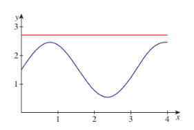

**Figure 1.32**
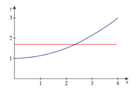
**Figure 1.33**
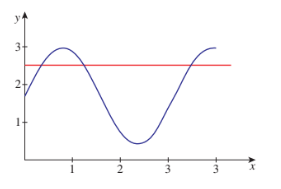
**Figure 1.34**

(i) If the horizontal line through a point \( y \) in the co-domain does not meet the curve, then there will be no pre-image for \( y \) and hence the function is not onto.

(ii) If the horizontal line through at least one point of the co-domain meets the curve at more than one point, then the function is not one-to-one.

(iii) If for all \( y \) in the range the horizontal line through \( y \) meets the curve at only one point, then the function is one-to-one.

So we may say,

- the function represented by a curve is one-to-one if and only if for all \( y \) in the range, the horizontal line through the point \( y \) meets the curve at exactly one point.
- the function represented by a curve is onto if and only if for all \( y \) in the co-domain, the horizontal line through the point \( y \) meets the curve at least one point.

The curve given in Figure 1.32 represents a function from \( [0,4] \) which is not onto if the co-domain contains \( [1,3] \). The curve given in Figure 1.33 represents a one-to-one function from \( [0,4] \) to \( \mathbb{R} \) and the curve given in Figure 1.34 represents a function from \( [0,4] \) to \( \mathbb{R} \) which is not one-to-one.

Testing whether a given curve represents a one-to-one function, onto function or not by drawing horizontal lines is called **horizontal line test** or simply horizontal test.

Further by seeing the diagrams in Illustration 1.2 and Figures 1.5 to 1.7, the function

(i) \( f : \mathbb{R} \to \mathbb{R} \) defined by \( f(x) = 2x \) is a one-to-one and onto function.

(ii) \( f : \mathbb{R} \to \mathbb{R} \) defined by \( f(x) = x^2 \) is neither one-to-one nor onto.

(iii) \( f : [0,\infty) \to \mathbb{R} \) defined by \( f(x) = +\sqrt{x} \) is a one-to-one but not onto function.

(iv) \( f : [0,\infty) \to [0,\infty) \) defined by \( f(x) = +\sqrt{x} \) is a one-to-one and onto function.

(v) \( f : [0,\infty) \to \mathbb{R} \) defined by \( f(x) = -\sqrt{x} \) is one-to-one but not onto function.

(vi) \( f : [0,\infty) \to (-\infty,0] \) defined by \( f(x) = -\sqrt{x} \) is one-to-one and onto function.

### Example 1.21

Find the largest possible domain for the real valued function \( f \) defined by \( f(x) = \sqrt{x^2 - 5x + 6} \).

**Solution:**

As we are finding the square root of \( x^2 - 5x + 6 \), we must have \( x^2 - 5x + 6 \geq 0 \) for all \( x \) in the domain. For this, follow the given procedure.

Solving \( x^2 - 5x + 6 = 0 \), we get \( x = 2 \) and 3. Now draw the number line as in Figure 1.35.
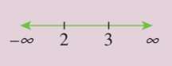
**Figure 1.35**

The quadratic expression changes sign at the points 2 and 3 only. So for \( x \) in \( (-\infty,2] \cup [3,\infty) \), we have \( x^2 - 5x + 6 \geq 0 \). So the natural domain is \( (-\infty,2] \cup [3,\infty) \). Hence the largest possible domain of \( f \) is \( (-\infty,2] \cup [3,\infty) \).

### Example 1.22

Find the domain of \( f(x) = \frac{1}{1 - 2\cos x} \).

**Solution:**

The function is defined for all \( x \in \mathbb{R} \) except \( 1 - 2\cos x = 0 \). That is, except \( \cos x = \frac{1}{2} \). That is except \( x = 2n\pi \pm \frac{\pi}{3}, n \in \mathbb{Z} \). Hence the domain is

$$
\mathbb{R} - \left\{2n\pi \pm \frac{\pi}{3}\right\}, n \in \mathbb{Z}
$$

### Example 1.23

Find the range of the function \( f(x) = \frac{1}{1 - 3\cos x} \).

**Solution:**

Clearly,

$$
-1 \leq \cos x \leq 1
$$

$$
\Rightarrow -3 \leq 3\cos x \leq 3
$$

$$
\Rightarrow -3 \leq -3\cos x \leq 3
$$

$$
\Rightarrow 1 - 3 \leq 1 - 3\cos x \leq 1 + 3
$$

$$
\Rightarrow -2 \leq 1 - 3\cos x \leq 4
$$

Thus we get \( -2 \leq 1 - 3\cos x \) and \( 1 - 3\cos x \leq 4 \). By taking reciprocals, we get

$$
\frac{1}{1 - 3\cos x} \leq -\frac{1}{2} \quad \text{and} \quad \frac{1}{1 - 3\cos x} \geq \frac{1}{4}.
$$

Hence the range of \( f \) is

$$
(-\infty, -\frac{1}{2}] \cup [\frac{1}{4}, \infty).
$$

### Example 1.24

Find the largest possible domain for the real valued function given by

$$
f(x) = \frac{\sqrt{9 - x^2}}{\sqrt{x^2 - 1}}.
$$

**Solution:**

If \( x < -3 \) or \( x > 3 \), then \( x^2 \) will be greater than 9 and hence \( 9 - x^2 \) will become negative which has no square root in \( \mathbb{R} \). So \( x \) must lie on the interval \( [-3,3] \).

Also if \( x \geq -1 \) and \( x \leq 1 \), then \( x^2 - 1 \) will become negative or zero. If it is negative, \( x^2 - 1 \) has no square root in \( \mathbb{R} \). If it is zero, \( f \) is not defined. So \( x \) must lie outside \( [-1,1] \). That is, \( x \) must lie on \( (-\infty, -1) \cup (1,\infty) \).

Combining these two conditions, the largest possible domain for \( f \) is

$$
[-3,3] \cap ((-\infty,-1) \cup (1,\infty)) = [-3,-1) \cup (1,3].
$$

Draw the number line and plot the intervals to get the required domain interval.

### 1.6.4 Operations on Functions

#### Composition

Let there be two functions \( f \) and \( g \) as given in the Figure 1.36 and Figure 1.37. Let us note that the co-domain of \( f \) and the domain of \( g \) are the same. Let us cut off Figure 1.37 of \( g \) and paste it on the Figure 1.36 of \( f \) so that the domain \( Y \) of \( g \) is pasted on co-domain \( Y \) of \( f \). (See Figure 1.38.)
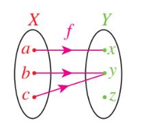
**Figure 1.36**
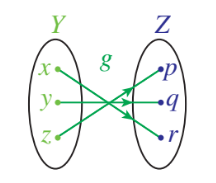
**Figure 1.37**
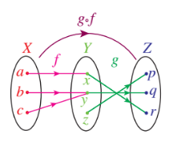
**Figure 1.38**

Now we can define a function \( h : X \to Z \) in a natural way. To find the image of \( a \) under \( h \), we first see the image of \( a \) under \( f \); it is \( x \); then we see the image of this \( x \) under \( g \); this is \( r \). That is, \( h(a) = r \). Similarly, we declare \( h(b) = q \) and \( h(c) = q \). In this way we can define a new function \( h \). This \( h \) is called the composition of \( f \) with \( g \).

### Definition 1.8

Let \( f : X \to Y \) and \( g : Y \to Z \) be two functions. Then the function \( h : X \to Z \) defined as

$$
h(x) = g(f(x))
$$

for every \( x \in X \) is called the **composition** of \( f \) with \( g \). It is denoted by \( g \circ f \) (Read this as \( f \) composite with \( g \)). (See Figures 1.38 and 1.39.)
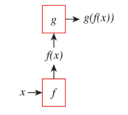
**Figure 1.39**

We can note that the range of \( f \) need not be \( Y \). If \( f : X \to Y_1 \), \( g : Y_2 \to Z \) and \( Y_1 \subseteq Y_2 \), then also we can define \( g \circ f \); we can take \( Y_2 \) as the co-domain of \( f \) and use the same definition. So we can define \( g \circ f \) if and only if the range of \( f \) is contained in the domain of \( g \).

### Example 1.25

Let \( f = \{(1,2),(3,4),(2,2)\} \) and \( g = \{(2,1),(3,1),(4,2)\} \). Find \( g \circ f \) and \( f \circ g \).

**Solution:**

To check whether compositions can be defined, let us find the domain and range of these functions.

Domain of \( f = \{1,2,3\} \), Range of \( f = \{2,4\} \), Domain of \( g = \{2,3,4\} \) and Range of \( g = \{1,2\} \). Since the range of \( f \) is contained in the domain of \( g \) we can define \( g \circ f \); so as to find the image of 1 under \( g \circ f \), we first find the image of 1 under \( f \) and then its image under \( g \). The image of 1 under \( f \) is 2 and its image under \( g \) is 1. So

$$
(g \circ f)(1) = g(f(1)) = g(2) = 1.
$$

Similarly,

\[
(g \circ f)(2) = g(f(2)) = g(2) = 1
\]
\[
(g \circ f)(3) = g(f(3)) = g(4) = 2
\]

Thus

$$
g \circ f = \{(1,1),(2,1),(3,2)\}.
$$

Range of \( g \) is \( \{1,2\} \) and domain of \( f \) is \( \{1,2,3\} \). As the range of \( g \) is not contained in the domain of \( f \), \( f \circ g \) is not defined.

### Example 1.26

If \( f(x) = 3x + 2 \) and \( g(x) = 2x^2 - 1 \), then find \( g \circ f \) and \( f \circ g \).

**Solution:**

\[
(g \circ f)(x) = g(f(x)) = g(3x + 2) = 2(3x + 2)^2 - 1 = 2(9x^2 + 12x + 4) - 1 = 18x^2 + 24x + 7.
\]

\[
(f \circ g)(x) = f(g(x)) = f(2x^2 - 1) = 3(2x^2 - 1) + 2 = 6x^2 - 3 + 2 = 6x^2 - 1.
\]

Note that \( f \circ g \neq g \circ f \).

### Example 1.27

If \( f,g : \mathbb{R} \to \mathbb{R} \) defined by \( f(x) = 2x + 1 \) and \( g(x) = x^2 + 2 \), find \( f \circ g \) and \( g \circ f \).

**Solution:**

\[
(f \circ g)(x) = f(g(x)) = f(x^2 + 2) = 2(x^2 + 2) + 1 = 2x^2 + 5.
\]

\[
(g \circ f)(x) = g(f(x)) = g(2x + 1) = (2x + 1)^2 + 2 = 4x^2 + 4x + 1 + 2 = 4x^2 + 4x + 3.
\]

Thus \( f \circ g \) and \( g \circ f \) are both defined and \( f \circ g \neq g \circ f \).

### Example 1.28

If \( f(x) = x + 5 \) and \( g(x) = x^2 - 3 \), find (i) \( f \circ f \) (ii) \( g \circ g \).

**Solution:**

\[
(f \circ f)(x) = f(f(x)) = f(x + 5) = (x + 5) + 5 = x + 10.
\]

\[
(g \circ g)(x) = g(g(x)) = g(x^2 - 3) = (x^2 - 3)^2 - 3 = x^4 - 6x^2 + 9 - 3 = x^4 - 6x^2 + 6.
\]
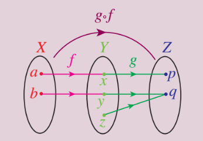

### Example 1.29

Let \( f,g : \mathbb{R} \to \mathbb{R} \) be defined as \( f(x) = 2x - |x| \) and \( g(x) = 2x + |x| \). Find \( f \circ g \).

**Solution:**

We know

$$
|x| = \begin{cases}
x, & \text{if } x \geq 0 \\
-x, & \text{if } x < 0
\end{cases}
$$

So

\[
f(x) = \begin{cases}
2x - x = x, & \text{if } x \geq 0 \\
2x - (-x) = 3x, & \text{if } x < 0
\end{cases}
\]

Thus

\[
f(x) = \begin{cases}
x, & x \geq 0 \\
3x, & x < 0
\end{cases}
\]

Also

\[
g(x) = \begin{cases}
2x + x = 3x, & \text{if } x \geq 0 \\
2x + (-x) = x, & \text{if } x < 0
\end{cases}
\]

Thus

\[
g(x) = \begin{cases}
3x, & x \geq 0 \\
x, & x < 0
\end{cases}
\]

Now

Let \( x \leq 0 \). Then

$$
(f \circ g)(x) = f(g(x)) = f(x) = 3x.
$$

The last equality is taken because \( 3x \leq 0 \) whenever \( x \leq 0 \).

Let \( x > 0 \). Then

$$
(f \circ g)(x) = f(g(x)) = f(3x) = 3x.
$$

Thus \( (f \circ g)(x) = 3x \) for all \( x \).

### 1.6.5 Inverse of a Function

Let there be a bijection \( f : X \to Y \) as given in the Figure 1.41.
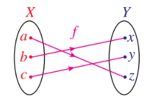
**Figure 1.41**

If we look this function in a mirror, we get a function from \( Y \) to \( X \). Let us call that function as \( g \). Then \( g \) is a function from \( Y \) to \( X \) defined by

$$
g(x) = b, \quad g(y) = c, \quad g(z) = a.
$$

This function \( g \) is an example for the inverse of \( f \). Now we define the inverse of a function.

### Definition 1.9

Let \( f : X \to Y \) be a bijection. The function \( g : Y \to X \) defined by \( g(y) = x \) if \( f(x) = y \), is called the **inverse** of \( f \) and is denoted by \( f^{-1} \).

If a function \( f \) has an inverse, then we say that \( f \) is **invertible**. There is a nice relationship between composition of functions and inverse.

Let \( f : X \to Y \) be a bijection and \( g : Y \to X \) be its inverse. Then

$$
g \circ f = I_X \quad \text{and} \quad f \circ g = I_Y
$$

where \( I_X \) and \( I_Y \) are identity functions on \( X \) and \( Y \) respectively. Moreover, if \( f : X \to Y \) and \( g : Y \to X \) are functions such that

$$
g \circ f = I_X \quad \text{and} \quad f \circ g = I_Y,
$$

then both \( f \) and \( g \) are bijections and they are inverses to each other; that is \( f^{-1} = g \) and \( g^{-1} = f \).

Using the discussions above, the terms invertible and inverse can be defined in some other way as follows:

### Definition 1.10

A function \( f : X \to Y \) is said to be **invertible** if there exists a function \( g : Y \to X \) such that

$$
g \circ f = I_X \quad \text{and} \quad f \circ g = I_Y
$$

where \( I_X \) and \( I_Y \) are identity functions on \( X \) and \( Y \) respectively. In this case, \( g \) is called the inverse of \( f \) and \( g \) is denoted by \( f^{-1} \).

We may use this concept to prove some functions are bijective.

If \( f \) is a bijection, then \( f^{-1}(y) \) is nothing but the pre-image of \( y \) under \( f \). Let us note that the inverses are defined only for bijections. If \( f \) is not one-to-one, then there exists \( a \) and \( b \) such that \( a \neq b \) and \( f(a) = f(b) \). Let this value be \( y \). Then we cannot define \( f^{-1}(y) \) because both \( a \) and \( b \) are pre-images of \( y \) under \( f \), as \( f^{-1} \) cannot assume two different values for \( y \). If \( f \) is not onto, then there will be a \( y \) in \( Y \) without a pre-image. In this case also we cannot assign any value to \( f^{-1}(y) \).

For example, if \( A = \{1,2,3,4\} \) and \( f = \{(1,2),(2,4),(3,1),(4,3)\} \). Then the range of \( f \) is \( \{1,2,3,4\} \); the inverse of \( f \) is \( \{(1,3),(2,1),(3,4),(4,2)\} \).

### Working Rule to Find the Inverse of Functions from \( \mathbb{R} \) to \( \mathbb{R} \):

Let \( f : \mathbb{R} \to \mathbb{R} \) be the given function.

i. write \( y = f(x) \)

ii. write \( x \) in terms of \( y \)

iii. write \( f^{-1}(y) = \) the expression in \( y \)

iv. replace \( y \) as \( x \)

### Example 1.30

If \( f : \mathbb{R} \to \mathbb{R} \) is defined by \( f(x) = 2x - 3 \) prove that \( f \) is a bijection and find its inverse.

**Solution:**

**Method 1:**

One-to-one: Let \( f(x) = f(y) \). Then \( 2x - 3 = 2y - 3 \); this implies that \( x = y \). That is, \( f(x) = f(y) \) implies that \( x = y \). Thus \( f \) is one-to-one.

Onto: Let \( y \in \mathbb{R} \). Let \( x = \frac{y + 3}{2} \). Then

$$
f(x) = 2\left(\frac{y + 3}{2}\right) - 3 = y.
$$

Thus \( f \) is onto. This also can be proved by saying the following statement. The range of \( f \) is \( \mathbb{R} \) (how?) which is equal to the co-domain and hence \( f \) is onto.

Inverse: Let \( y = 2x - 3 \). Then \( y + 3 = 2x \) and hence \( x = \frac{y + 3}{2} \). Thus

$$
f^{-1}(y) = \frac{y + 3}{2}.
$$

By replacing \( y \) as \( x \), we get

$$
f^{-1}(x) = \frac{x + 3}{2}.
$$

**Method 2:**

Let \( y = 2x - 3 \). Then \( x = \frac{y + 3}{2} \). Let \( g(y) = \frac{y + 3}{2} \). Now

\[
(g \circ f)(x) = g(f(x)) = g(2x - 3) = \frac{(2x - 3) + 3}{2} = x.
\]

\[
(f \circ g)(y) = f(g(y)) = f\left(\frac{y + 3}{2}\right) = 2\left(\frac{y + 3}{2}\right) - 3 = y.
\]

Thus, \( g \circ f = I_X \) and \( f \circ g = I_Y \). This implies that \( f \) and \( g \) are bijections and inverses to each other. Hence \( f \) is a bijection and \( f^{-1}(y) = \frac{y + 3}{2} \). Replacing \( y \) by \( x \) we get, \( f^{-1}(x) = \frac{x + 3}{2} \).

#### 1.6.6 Algebra of Functions

A function whose co-domain is \( \mathbb{R} \) or a subset of \( \mathbb{R} \) is called a real valued function. We can discuss many more operations on functions if it is real valued.

Let \( f \) and \( g \) be two real valued functions. Can we define addition of \( f \) and \( g \)? Naturally we expect the sum of two functions to be a function. The value of \( f + g \) at a point \( x \) should be related to the values of \( f \) and \( g \) at \( x \). So to define \( f + g \) at a point \( x \), we must know both \( f(x) \) and \( g(x) \). In other words \( x \) must be in the domain of \( f \) as well as in the domain of \( g \). And the natural way of defining \( f + g \) at \( x \) is \( f(x) + g(x) \). So if we impose a condition that the domains of \( f \) and \( g \) to be the same, then we can define \( f + g \). In the same way we can define subtraction, multiplication and many more algebraic operations available on the set \( \mathbb{R} \) of the real numbers.

### Definition 1.11

Let \( X \) be any set. Let \( f \) and \( g \) be real valued functions defined on \( X \). Define, for all \( x \in X \)

\[
(f + g)(x) = f(x) + g(x)
\]

\[
(f - g)(x) = f(x) - g(x)
\]

\[
(fg)(x) = f(x)g(x)
\]

\[
\left(\frac{f}{g}\right)(x) = \frac{f(x)}{g(x)}, \text{ where } g(x) \neq 0
\]

\[
(cf)(x) = cf(x), \text{ where } c \text{ is a real constant}
\]

\[
(-f)(x) = -f(x)
\]

Note that the domain may be any set, not necessarily a set of numbers. For example if \( X \) is a set of students of a class, \( f \) and \( g \) functions representing the marks obtained by the students in two tests, then the function \( f + g \) represent the total marks of the students in the two tests. It is easy to see that the operations addition, subtraction, multiplication and division defined above satisfy the following properties.

\[
(f + g) + h = f + (g + h)
\]

\[
f + g = g + f
\]

\[
0 + f = f + 0, \text{ where } 0 \text{ is the zero function defined by } 0(x) = 0 \text{ for all } x
\]

\[
f + (-f) = (-f) + f = 0
\]

\[
f(g + h) = fg + fh
\]

\[
(c_1 + c_2)f = c_1f + c_2f \text{ where } c_1 \text{ and } c_2 \text{ are real constants}
\]

We can list many more properties of these operations. The proofs are simple; however let us prove only one to show a way in which these properties can be proved.

Let us prove \( f(g + h) = fg + fh \). To prove \( f(g + h) = fg + fh \) we have to prove that

$$
(f(g + h))(x) = (fg + fh)(x)
$$

for all \( x \) in the domain.

### 1.6.7 Some Special Functions

Now let us see some special functions.

(i) The function \( f : \mathbb{R} \to \mathbb{R} \) defined by

$$
f(x) = a_0x^n + a_1x^{n-1} + a_2x^{n-2} + \ldots + a_{n-1}x + a_n,
$$

where \( a_i \) are constants, is called a **polynomial function**. Since the right hand side of the equality defining the function is a polynomial, this function is called a polynomial function.

(ii) The function \( f : \mathbb{R} \to \mathbb{R} \) defined by \( f(x) = ax + b \) where \( a \neq 0 \) and \( b \) are constants, is called a **linear function**. A function which is not linear is called a non-linear function.

Clearly a linear function is a polynomial function. The graph of this function is a straight line; a straight line is called a linear curve; so this function is called a linear function. (one may come across different definitions for linear functions in higher study of mathematics.)

(iii) Let \( a \) be a non-negative constant. Consider the function \( f : \mathbb{R} \to \mathbb{R} \) defined by \( f(x) = a^x \). If \( a = 0, x \neq 0 \) then the function becomes the zero function and if \( a = 1 \), then function \( f : \mathbb{R} \to \mathbb{R} \) defined by \( f(x) = a^x \) is the constant function \( f(x) = 1 \). [See, Figures 1.42 and 1.43].
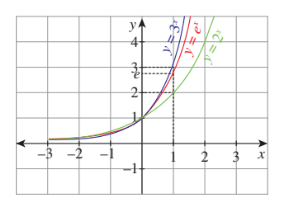
**Figure 1.42**
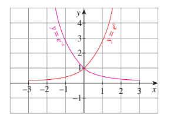
**Figure 1.43**

When \( a > 1 \), the function \( f(x) = a^x \) is called an **exponential function**. Moreover, any function having \( x \) in the "power" is called as an exponential function.

\( e \) is a special irrational number lies between 2 and 3. We will study more about \( e \) in the subsequent chapters.

(iv) Let \( a > 1 \) be a constant. The function \( f : (0,\infty) \to \mathbb{R} \) defined by \( f(x) = \log_a x \) is called a **logarithmic function**. In fact, the inverse of an exponential function \( f(x) = a^x \) on a suitable domain is called a logarithmic function. [See, Figure 1.44].

(v) The real valued function \( f \) defined by \( f(x) = \frac{p(x)}{q(x)} \) on a suitable domain, where \( p(x) \) and \( q(x) \) are polynomials, \( q(x) \neq 0 \), is called a **rational function**. In fact, the domain of this function is the set obtained from \( \mathbb{R} \) by removing the real numbers at which \( q(x) = 0 \).
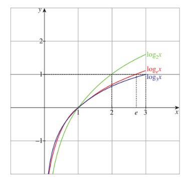
**Figure 1.44**

(vi) If \( f \) is a real valued function such that \( f(x) \neq 0 \), then the real valued function \( g \) defined by \( g(x) = \frac{1}{f(x)} \) on a suitable domain is called the **reciprocal function** of \( f \). The domain of \( g \) is the set obtained from \( \mathbb{R} \) by removing the real numbers at which \( f(x) = 0 \). For example, the largest possible domain of \( f(x) = \frac{1}{x - 1} \) is \( \mathbb{R} - \{1\} \).

Let us see two more categories of functions.

### Definition 1.12

A function \( f : \mathbb{R} \to \mathbb{R} \) is said to be an **odd function** if

$$
f(-x) = -f(x) \quad \text{for all } x \in \mathbb{R}.
$$

It is said to be an **even function** if

$$
f(-x) = f(x) \quad \text{for all } x \in \mathbb{R}.
$$

[See, Figures 1.45 and 1.46].
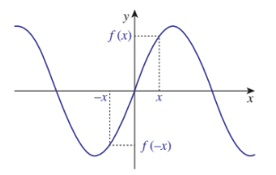
**Figure 1.45**
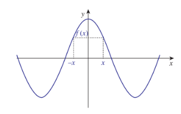
**Figure 1.46**

The function defined by \( f(x) = x \), \( f(x) = 2x \) and \( f(x) = x^3 + 2x \) are some examples for odd functions. The functions defined by \( f(x) = x^2 \), \( f(x) = 3 \), \( f(x) = x^4 + x^2 \) and \( f(x) = |x| \) are some examples for even functions. Note that the function \( f(x) = x + x^2 \) is neither even nor odd.

We can prove the following results.

(i) The sum of two odd functions is an odd function.

(ii) The sum of two even functions is an even function.

(iii) The product of two odd functions is an even function.

(iv) The product of two even functions is an even function.

(v) The product of an odd function and an even function is an odd function.

(vi) The only function which is both odd and even function is the zero function.

(vii) The product of a positive constant and an even function is an even function.

(viii) The product of a negative constant and an even function is also an even function.

(ix) The product of a constant and an odd function is an odd function.

(x) There are functions which are neither odd nor even.

Let us prove one of the above properties. The other properties can be proved similarly.

**Property:** The product of an odd function and an even function is an odd function.

**Proof.** Let \( f \) be an odd function and \( g \) be an even function. Let \( h = fg \). Now

\[
h(-x) = (fg)(-x) = f(-x)g(-x) = -f(x)g(x) \quad (\text{as } f \text{ is odd and } g \text{ is even})
\]

\[
= -h(x)
\]

Thus \( h \) is an odd function. This shows that \( fg \) is an odd function.

If one function is not odd then don't think that the function is an even function. There are plenty of functions which are neither even nor odd.

## Exercise 1.3

1. Suppose that 120 students are studying in 4 sections of eleventh standard in a school. Let \( A \) denote the set of students and \( B \) denote the set of the sections. Define a relation from \( A \) to \( B \) as "\( x \) related to \( y \) if the student \( x \) belongs to the section \( y \)". Is this relation a function? What can you say about the inverse relation? Explain your answer.

2. Write the values of \( f \) at \( -4, 1, -2, 7, 0 \) if

$$
f(x) = \begin{cases}
3x + 4, & \text{if } x < 0 \\
2x + 5, & \text{if } 0 \leq x < 4 \\
x^2 - 1, & \text{if } x \geq 4
\end{cases}
$$

3. Write the values of \( f \) at \( -3, 5, 2, -1, 0 \) if

$$
f(x) = \begin{cases}
x^2 + x - 3, & \text{if } x < -1 \\
3x - 2, & \text{if } -1 \leq x < 2 \\
2x^2 - 3, & \text{if } x \geq 2
\end{cases}
$$

4. State whether the following relations are functions or not. If it is a function check for one-to-oneness and ontoness. If it is not a function, state why?

   (i) If \( A = \{a,b,c\} \) and \( f = \{(a,c),(b,c),(c,b)\} \); \( f : A \to A \)

   (ii) If \( X = \{x,y,z\} \) and \( f = \{(x,y),(x,z),(z,x)\} \); \( f : X \to X \)

5. Let \( A = \{1,2,3,4\} \) and \( B = \{a,b,c,d\} \). Give a function from \( A \to B \) for each of the following:

   (i) neither one-to-one nor onto.

   (ii) not one-to-one but onto.

   (iii) one-to-one but not onto.

   (iv) one-to-one and onto.

6. Find the domain of \( \frac{1}{1 - 2\sin x} \).

7. Find the largest possible domain of the real valued function \( f(x) = \frac{\sqrt{4 - x^2}}{\sqrt{x^2 - 9}} \).

8. Find the range of the function \( \frac{1}{2\cos x - 1} \).

9. Show that the relation \( xy = -2 \) is a function for a suitable domain. Find the domain and the range of the function.

10. If \( f,g : \mathbb{R} \to \mathbb{R} \) are defined by \( f(x) = |x| + x \) and \( g(x) = |x| - x \), find \( g \circ f \) and \( f \circ g \).

11. If \( f,g,h \) are real valued functions defined on \( \mathbb{R} \), then prove that \( (f + g) \circ h = f \circ h + g \circ h \). What can you say about \( f \circ (g + h) \)? Justify your answer.

12. If \( f : \mathbb{R} \to \mathbb{R} \) is defined by \( f(x) = 3x - 5 \), prove that \( f \) is a bijection and find its inverse.

13. The weight of the muscles of a man is a function of his body weight \( x \) and can be expressed as \( W(x) = 0.35x \). Determine the domain of this function.

14. The distance of an object falling is a function of time \( t \) and can be expressed as \( s(t) = -16t^2 \). Graph the function and determine if it is one-to-one.

15. The total cost of airfare on a given route is comprised of the base cost \( C \) and the fuel surcharge \( S \) in rupee. Both \( C \) and \( S \) are functions of the mileage \( m \); \( C(m) = 0.4m + 50 \) and \( S(m) = 0.03m \). Determine a function for the total cost of a ticket in terms of the mileage and find the airfare for flying 1600 miles.

16. A salesperson whose annual earnings can be represented by the function \( A(x) = 30{,}000 + 0.04x \), where \( x \) is the rupee value of the merchandise he sells. His son is also in sales and his earnings are represented by the function \( S(x) = 25{,}000 + 0.05x \). Find \( (A + S)(x) \) and determine the total family income if they each sell Rupees \( 1{,}50{,}00{,}000 \) worth of merchandise.

17. The function for exchanging American dollars for Singapore Dollar on a given day is \( f(x) = 1.23x \), where \( x \) represents the number of American dollars. On the same day the function for exchanging Singapore Dollar to Indian Rupee is \( g(y) = 50.50y \), where \( y \) represents the number of Singapore dollars. Write a function which will give the exchange rate of American dollars in terms of Indian rupee.

18. The owner of a small restaurant can prepare a particular meal at a cost of Rupees 100. He estimates that if the menu price of the meal is \( x \) rupees, then the number of customers who will order that meal at that price in an evening is given by the function \( D(x) = 200 - x \). Express his day revenue, total cost and profit on this meal as functions of \( x \).

19. The formula for converting from Fahrenheit to Celsius temperatures is \( y = \frac{5x}{9} - \frac{160}{9} \). Find the inverse of this function and determine whether the inverse is also a function.

20. A simple cipher takes a number and codes it, using the function \( f(x) = 3x - 4 \). Find the inverse of this function, determine whether the inverse is also a function and verify the symmetrical property about the line \( y = x \) (by drawing the lines).

## 1.7 Graphing Functions using Transformations

"A picture is worth a thousand words" is a well known proverb. To know about a function well, its graph will help us more than its analytical expression. To draw graphs quickly without plotting many points is an invaluable skill. Familiarity with shapes of some basic functions will help to graph other complicated functions. Understanding and usage of symmetry and transformations will then enable to strengthen graphing abilities. This section is not simply a data base of graphs, we learn some methods to graph certain functions.

Suppose that we want to draw or sketch the curve of the function \( y = 2\sin(x - 1) + 3 \). At the very first sight it looks that it is very difficult to draw the curve representing this function. But it will be very easy to draw after understanding the content of this section.

If we know a half of a graph is the mirror image of the other half with respective to a line, or a graph can be obtained just by moving a known graph in some direction, then we can draw the new one using the known one. Moreover if we know that a graph can be obtained by enlarging or shrinking a known one, then also we can draw the new one using the known ones.

The following type of transformations play very important roles in graphing.

(i) **Reflection**

(ii) **Translation**

(iii) **Dilations**.

In the case of reflections and translations, they produce graphs congruent to the original graph; that is, the size and the shape of the graph does not change, but in dilation, it produce graphs with shapes related to those of the original graph.

### Reflection

The reflection of the graph of a function with respect to a line \( \ell \) is the graph that is symmetric to it with respect to \( \ell \). A reflection is the mirror image of the graph where line \( \ell \) is the mirror of the reflection. (See Figure 1.47.)
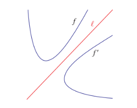
**Figure 1.47**

Here \( f' \) is the mirror image of \( f \) with respect to \( \ell \). Every point of \( f \) has a corresponding image in \( f' \). Some useful reflections of \( y = f(x) \) are

(i) The graph \( y = -f(x) \) is the reflection of the graph of \( f \) about the \( x \)-axis.

(ii) The graph \( y = f(-x) \) is the reflection of the graph of \( f \) about the \( y \)-axis.

(iii) The graph of \( y = f^{-1}(x) \) is the reflection of the graph of \( f \) in \( y = x \).

### Illustration 1.5

Consider the functions:

(i) \( y = x^2 \)

(ii) \( y = -x^2 \)
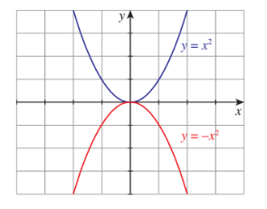
**Figure 1.48**

For the curve \( f(x) = x^2 \), \( -f(x) = -x^2 \). Hence, \( y = -x^2 \) is the reflection of \( y = x^2 \) about \( x \)-axis. (See Figure 1.48.)

### Illustration 1.6

Consider the positive branches of

\( y^2 = x \) and \( y^2 = -x \).
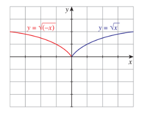
**Figure 1.49**

For the curve \( f(x) = \sqrt{x} \), we have \( f(-x) = \sqrt{-x} \) and hence \( f(-x) = \sqrt{-x} \) where \( x < 0 \), is the reflection of \( f(x) = \sqrt{x} \) about \( y \)-axis. (See Figure 1.49.)

### Illustration 1.7

Consider the functions:

(i) \( y = e^x \)

(ii) \( y = \log_e x \)

**Figure 1.50**

We know that, \( y = e^x \) is the inverse function of \( y = \log_e x \) and hence \( y = e^x \) is the reflection of \( y = \log_e x \) about \( y = x \). (See Figure 1.50.)

### Translation

A translation of a graph is a vertical or horizontal shift of the graph that produces congruent graphs.

- \( y = f(x + c), c > 0 \) causes the shift to the left.
- \( y = f(x - c), c > 0 \) causes the shift to the right.
- \( y = f(x) + d, d > 0 \) causes the shift to the upward.
- \( y = f(x) - d, d > 0 \) causes the shift to the downward.

### Illustration 1.8

Consider the functions:

(i) \( f(x) = |x| \)

(ii) \( f(x) = |x - 1| \)

(iii) \( f(x) = |x + 1| \)

**Figure 1.51**

\( f(x) = |x - 1| \) causes the graph of the function \( f(x) = |x| \) shifts to the right for one unit. \( f(x) = |x + 1| \) causes the graph of the function \( f(x) = |x| \) shifts to the left for one unit. (See Figure 1.51.)

### Illustration 1.9

Consider the functions:

(i) \( f(x) = |x| \)

(ii) \( f(x) = |x| - 1 \)

(iii) \( f(x) = |x| + 1 \)

**Figure 1.52**

\( f(x) = |x| - 1 \) causes the graph of the function \( f(x) = |x| \) shifts to the downward for one unit. \( f(x) = |x| + 1 \) causes the graph of the function \( f(x) = |x| \) shifts to the upward for one unit. (See Figure 1.52.)

### Dilation

Dilation is also a transformation which causes the curve stretches (expands) or compresses (contracts). Multiplying a function by a positive constant vertically stretches or compresses its graph; that is, the graph moves away from \( x \)-axis or towards \( x \)-axis.

- If the positive constant is greater than one, the graph moves away from the \( x \)-axis.
- If the positive constant is less than one, the graph moves towards the \( x \)-axis.

### Illustration 1.10

Consider the functions:

(i) \( f(x) = x^2 \)

(ii) \( f(x) = \frac{1}{2}x^2 \)

(iii) \( f(x) = 2x^2 \)

**Figure 1.53**

\( f(x) = \frac{1}{2}x^2 \) causes the graph of the function \( f(x) = x^2 \) stretches towards the \( x \)-axis since the multiplying factor is \( \frac{1}{2} \) which is less than one.

\( f(x) = 2x^2 \) causes the graph of the function \( f(x) = x^2 \) compresses towards the \( y \)-axis that is, moves away from the \( x \)-axis since the multiplying factor is 2 which is greater than one. (See Figure 1.53.)

### Illustration 1.11

Consider the functions:

(i) \( f(x) = x^2 \)

(ii) \( f(x) = x^2 + 1 \)

(iii) \( f(x) = (x + 1)^2 \)

**Figure 1.54**

\( f(x) = x^2 + 1 \) causes the graph of the function \( f(x) = x^2 \) shifts to the upward for one unit. \( f(x) = (x + 1)^2 \) causes the graph of the function \( f(x) = x^2 \) shifts to the left for one unit. (See Figure 1.54.)

### Illustration 1.12

Compare and contrast the graphs \( y = x^2 - 1 \), \( y = 4(x^2 - 1) \) and \( y = (4x)^2 - 1 \).

**Figure 1.55**

**Figure 1.56**

**Figure 1.57**

The graphs Figures 1.55 and 1.56 look identical until we compare the scales on the \( y \)-axis. The scale in Figure 1.56 is four times as large, reflecting the multiplication of the original function by 4 (Figure 1.55). The effect looks different when the functions are plotted on the same scale as in Figure 1.57.

The graph of \( y = (4x)^2 - 1 \) is shown in Figure 1.58. Can you spot the difference between Figure 1.55 and Figure 1.58? In this case, \( x \)-scale has now changed, by the same factor of 4 as in the function (Figure 1.58). To see this, note that substituting \( x = \frac{1}{4} \) into \( (4x)^2 - 1 \) produces \( 1^2 - 1 \), exactly the same as substituting \( x = 1 \) into the original function (Figure 1.55). When plotted on the same set of axes (as in Figure 1.59) the parabola \( y = (4x)^2 - 1 \) looks thinner. Here, the \( x \)-intercepts are different, but \( y \)-intercepts are the same.

**Figure 1.58**

**Figure 1.59**

### Illustration 1.13

By using the same concept applied in Illustration 1.12, graphs of \( y = \sin x \) and \( y = \sin 2x \), and also their combined graphs are given Figures 1.60, 1.61 and 1.62. The minimum and maximum values of \( \sin x \) and \( \sin 2x \) are the same. But they have different \( x \)-intercepts. The \( x \)-intercepts for \( y = \sin x \) are \( \pm n\pi \) and for \( y = \sin 2x \) are \( \pm \frac{1}{2}n\pi \), \( n \in \mathbb{Z} \).

**Figure 1.60**

**Figure 1.61**

**Figure 1.62**

In the beginning of the section we talked about drawing the graph of \( y = 2\sin(x - 1) + 3 \). Now we are well equipped to draw the curve and even we can draw more complicated curve.

### Illustration 1.14

Let us now draw the graph of \( y = 2\sin(x - 1) + 3 \).

It is clear that the curve can be obtained from that of \( y = \sin x \) using translation and dilation.

So first we draw \( y = \sin x \). From that it is easy to draw the curve \( y = \sin(x - 1) \); then draw \( y = 2\sin(x - 1) \) and finally \( y = 2\sin(x - 1) + 3 \). (See Figures 1.63 to 1.66.)

**Figure 1.63**

**Figure 1.64**

**Figure 1.65**

**Figure 1.66**

## Exercise 1.4

1. For the curve \( y = x^3 \) given in Figure 1.67, draw

   (i) \( y = -x^3 \)

   (ii) \( y = x^3 + 1 \)

   (iii) \( y = x^3 - 1 \)

   (iv) \( y = (x + 1)^3 \)

   with the same scale.

**Figure 1.67**

2. For the curve \( y = x^{\frac{1}{3}} \) given in Figure 1.68, draw

   (i) \( y = -x^{\frac{1}{3}} \)

   (ii) \( y = x^{\frac{1}{3}} + 1 \)

   (iii) \( y = x^{\frac{1}{3}} - 1 \)

   (iv) \( y = (x + 1)^{\frac{1}{3}} \)

**Figure 1.68**

3. Graph the functions \( f(x) = x^3 \) and \( g(x) = \sqrt[3]{x} \) on the same coordinate plane. Find \( f \circ g \) and graph it on the plane as well. Explain your results.

4. Write the steps to obtain the graph of the function \( y = 3(x - 1)^2 + 5 \) from the graph \( y = x^2 \).

5. From the curve \( y = \sin x \), graph the functions

   (i) \( y = \sin(-x) \)

   (ii) \( y = -\sin(-x) \)

   (iii) \( y = \sin\left(\frac{\pi}{2} + x\right) \) which is \( \cos x \)

   (iv) \( y = \sin\left(\frac{\pi}{2} - x\right) \) which is also \( \cos x \) (refer trigonometry)

6. From the curve \( y = x \), draw

   (i) \( y = -x \)

   (ii) \( y = 2x \)

   (iii) \( y = x + 1 \)

   (iv) \( y = \frac{1}{2}x + 1 \)

   (v) \( 2x + y + 3 = 0 \)

7. From the curve \( y = |x| \), draw

   (i) \( y = |x - 1| + 1 \)

   (ii) \( y = |x + 1| - 1 \)

   (iii) \( y = |x + 2| - 3 \)

8. From the curve \( y = \sin x \), draw \( y = \sin|x| \) (Hint: \( \sin(-x) = -\sin x \)).

## Exercise 1.5

1. Interpret the above data as,

   (i) a relation

   (ii) a function

   (iii) an onto function

   (iv) can you make the data as a one-to-one function? If not, why?

2. Identify the curves in Figure 1.69 and the corresponding equations for the base curve \( y = x^2 \) (graph with dotted line) by seeing the scale.

**Figure 1.69**

## Multiple Choice Questions

1. If \( A = \{(x,y) : y = e^x, x \in \mathbb{R}\} \) and \( B = \{(x,y) : y = e^{-x}, x \in \mathbb{R}\} \) then \( n(A \cap B) \) is

   (1) Infinity

   (2) 0

   (3) 1

   (4) 2

2. If \( A = \{(x,y) : y = \sin x, x \in \mathbb{R}\} \) and \( B = \{(x,y) : y = \cos x, x \in \mathbb{R}\} \) then \( A \cap B \) contains

   (1) no element

   (2) infinitely many elements

   (3) only one element

   (4) cannot be determined

3. The relation \( R \) defined on a set \( A = \{0, -1, 1, 2\} \) by \( xRy \) if \( |x^2 + y^2| \leq 2 \), then which one of the following is true?

   (1) \( R = \{(0,0),(0,-1),(0,1),(-1,0),(-1,1),(1,2),(1,0)\} \)

   (2) \( R^{-1} = \{(0,0),(0,-1),(0,1),(-1,0),(1,0)\} \)

   (3) Domain of \( R \) is \( \{0,-1,1,2\} \)

   (4) Range of \( R \) is \( \{0,-1,1\} \)

4. If \( f(x) = |x - 2| + |x + 2|, x \in \mathbb{R} \), then

   (1) \( f(x) = \begin{cases} -2x, & x < -2 \\ 4, & -2 \leq x \leq 2 \\ 2x, & x > 2 \end{cases} \)

   (2) \( f(x) = \begin{cases} 2x, & x < -2 \\ 4, & -2 \leq x \leq 2 \\ -2x, & x > 2 \end{cases} \)

   (3) \( f(x) = \begin{cases} 2x, & x < -2 \\ -4, & -2 \leq x \leq 2 \\ -2x, & x > 2 \end{cases} \)

   (4) \( f(x) = \begin{cases} -2x, & x < -2 \\ 4, & -2 \leq x \leq 2 \\ 2x, & x > 2 \end{cases} \)

5. Let \( \mathbb{R} \) be the set of all real numbers. Consider the following subsets of the plane \( \mathbb{R} \times \mathbb{R} \).

   \( S = \{(x,y) : y = x + 1 \text{ and } 0 < x < 2\} \) and \( T = \{(x,y) : x - y \text{ is an integer}\} \)

   Then which of the following is true?

   (1) \( T \) is an equivalence relation but \( S \) is not an equivalence relation.

   (2) Neither \( S \) nor \( T \) is an equivalence relation

   (3) Both \( S \) and \( T \) are equivalence relation

   (4) \( S \) is an equivalence relation but \( T \) is not an equivalence relation.

6. Let \( A \) and \( B \) be subsets of the universal set \( \mathbb{N} \), the set of natural numbers. Then \( A' \cup [(A \cap B) \cup B'] \) is

   (1) \( A \)

   (2) \( A' \)

   (3) \( B \)

   (4) \( \mathbb{N} \)

7. The number of students who take both the subjects Mathematics and Chemistry is 70. This represents \( 10\% \) of the enrollment in Mathematics and \( 14\% \) of the enrollment in Chemistry. The number of students take at least one of these two subjects, is

   (1) 1120

   (2) 1130

   (3) 1100

   (4) insufficient data

8. If \( n((A \times B) \cap (A \times C)) = 8 \) and \( n(B \cap C) = 2 \), then \( n(A) \) is

   (1) 6

   (2) 4

   (3) 8

   (4) 16

9. If \( n(A) = 2 \) and \( n(B \cup C) = 3 \), then \( n[(A \times B) \cup (A \times C)] \) is

   (1) \( 2^3 \)

   (2) \( 3^2 \)

   (3) 6

   (4) 5

10. If two sets \( A \) and \( B \) have 17 elements in common, then the number of elements common to the set \( A \times B \) and \( B \times A \) is

    (1) \( 2^{17} \)

    (2) \( 17^2 \)

    (3) 34

    (4) insufficient data

11. For non-empty sets \( A \) and \( B \), if \( A \subset B \) then \( (A \times B) \cap (B \times A) \) is equal to

    (1) \( A \cap B \)

    (2) \( A \times A \)

    (3) \( B \times B \)

    (4) none of these

12. The number of relations on a set containing 3 elements is

    (1) 9

    (2) 81

    (3) 512

    (4) 1024

13. Let \( R \) be the universal relation on a set \( X \) with more than one element. Then \( R \) is

    (1) not reflexive

    (2) not symmetric

    (3) transitive

    (4) none of the above

14. Let \( X = \{1,2,3,4\} \) and \( R = \{(1,1),(1,2),(1,3),(2,2),(3,3),(2,1),(3,1),(1,4),(4,1)\} \). Then \( R \) is

    (1) reflexive

    (2) symmetric

    (3) transitive

    (4) equivalence

15. The range of the function \( \frac{1}{1 - 2\sin x} \) is

    (1) \( (-\infty, -1) \cup (\frac{1}{3}, \infty) \)

    (2) \( (-1, \frac{1}{3}) \)

    (3) \( [-1, \frac{1}{3}] \)

    (4) \( (-\infty, -1) \cup [\frac{1}{3}, \infty) \)

16. The range of the function \( f(x) = |[x] - x|, x \in \mathbb{R} \) is

    (1) \( [0,1] \)

    (2) \( [0, \infty) \)

    (3) \( [0,1) \)

    (4) \( (0,1) \)

17. The rule \( f(x) = x^2 \) is a bijection if the domain and the co-domain are given by

    (1) \( \mathbb{R}, \mathbb{R} \)

    (2) \( \mathbb{R}, (0, \infty) \)

    (3) \( (0, \infty), \mathbb{R} \)

    (4) \( [0, \infty), [0, \infty) \)

18. The number of constant functions from a set containing \( m \) elements to a set containing \( n \) elements is

    (1) \( mn \)

    (2) \( m \)

    (3) \( n \)

    (4) \( m + n \)

19. The function \( f : [0, 2\pi] \to [-1, 1] \) defined by \( f(x) = \sin x \) is

    (1) one-to-one

    (2) onto

    (3) bijection

    (4) cannot be defined

20. If the function \( f : [-3, 3] \to S \) defined by \( f(x) = x^2 \) is onto, then \( S \) is

    (1) \( [-9, 9] \)

    (2) \( \mathbb{R} \)

    (3) \( [-3, 3] \)

    (4) \( [0, 9] \)

21. Let \( X = \{1,2,3,4\} \), \( Y = \{a,b,c,d\} \) and \( f = \{(1,a),(4,b),(2,c),(3,d),(2,d)\} \). Then \( f \) is

    (1) a one-to-one function

    (2) an onto function

    (3) a function which is not one-to-one

    (4) not a function

22. The inverse of \( f(x) = \begin{cases} x, & \text{if } x < 1 \\ x^2, & \text{if } 1 \leq x \leq 4 \\ 8\sqrt{x}, & \text{if } x > 4 \end{cases} \) is

    (1) \( f^{-1}(x) = \begin{cases} x, & \text{if } x < 1 \\ \sqrt{x}, & \text{if } 1 \leq x \leq 16 \\ \frac{x^2}{64}, & \text{if } x > 16 \end{cases} \)

    (2) \( f^{-1}(x) = \begin{cases} -x, & \text{if } x < 1 \\ \sqrt{x}, & \text{if } 1 \leq x \leq 16 \\ \frac{x^2}{64}, & \text{if } x > 16 \end{cases} \)

    (3) \( f^{-1}(x) = \begin{cases} x^2, & \text{if } x < 1 \\ \sqrt{x}, & \text{if } 1 \leq x \leq 16 \\ \frac{x^2}{64}, & \text{if } x > 16 \end{cases} \)

    (4) \( f^{-1}(x) = \begin{cases} 2x, & \text{if } x < 1 \\ \sqrt{x}, & \text{if } 1 \leq x \leq 16 \\ \frac{x^2}{8}, & \text{if } x > 16 \end{cases} \)

23. Let \( f : \mathbb{R} \to \mathbb{R} \) be defined by \( f(x) = 1 - |x| \). Then the range of \( f \) is

    (1) \( \mathbb{R} \)

    (2) \( (1, \infty) \)

    (3) \( (-1, \infty) \)

    (4) \( (-\infty, 1] \)

24. The function \( f : \mathbb{R} \to \mathbb{R} \) is defined by \( f(x) = \sin x + \cos x \) is

    (1) an odd function

    (2) neither an odd function nor an even function

    (3) an even function

    (4) both odd function and even function

25. The function \( f : \mathbb{R} \to \mathbb{R} \) is defined by

    $$
    f(x) = \frac{(x^2 + \cos x)(1 + x^4)}{(x - \sin x)(2x - x^3) + e^{-|x|}}
    $$

    is

    (1) an odd function

    (2) neither an odd function nor an even function

    (3) an even function

    (4) both odd function and even function

## Summary

In this chapter we have acquired the knowledge of

- **Set**
  - Subset, super set, trivial subset, proper subset, improper subset
  - Empty set, power set, universal set, singleton set, finite set, infinite set
  - Cardinality of a set
  - Union, Intersection, Complement, Set Difference, Symmetric Difference
  - Properties and De Morgan Laws
  - Cartesian Product

- **Intervals**
  - Constants, dependent and independent variables
  - Open, Closed, finite and infinite intervals and neighbourhoods

- **Relations**
  - Domain and range of relation
  - Extreme relations (empty and universal)
  - Inverse of a relation
  - Reflexive, Symmetric, Transitive, Equivalence Relations

- **Functions**
  - Definition, domain, co-domain, range, image, pre-image
  - Tabular, graphical, analytical and piecewise representations
  - Identity function, constant function, zero function, modulus function, signum function, greatest integer function, smallest integer function
  - Injective, surjective and bijective functions
  - Vertical test and Horizontal test
  - Composition of functions, inverse of a function
  - Addition and multiplication of real valued functions
  - Polynomial function, linear function, exponential function, logarithmic function, rational function, reciprocal function
  - Odd and Even functions

- **Graphing functions**
  - Reflection, translation, dilation
  - Drawing graph of some seems to be complicated functions

